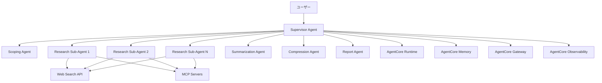

# 設計: Open Deep Research を Strands Agents で再現

## 1. アーキテクチャ概要

### 1.1 システム全体構成



### 1.2 Strands Agents実装パターン

#### マルチエージェントアーキテクチャ
- **Agent-to-Agent (A2A) 通信**: 構造化されたメッセージ交換プロトコル
- **Swarm パターン**: 動的なResearch Sub-Agentsの管理
- **Graph ワークフロー**: 3段階制御ループの実装
- **Session Management**: セッション状態の一貫性保持

#### エージェントの役割分担
1. **Supervisor Agent**: オーケストレーター（単一、永続）
2. **Scoping Agent**: 要求明確化（オンデマンド）
3. **Research Sub-Agents**: 並行研究実行（動的生成）
4. **Summarization Agent**: 情報統合（オンデマンド）
5. **Compression Agent**: データ最適化（オンデマンド）
6. **Report Agent**: 最終出力生成（単一）

## 2. Strands Agentsマルチエージェント設計

### 2.1 エージェント定義と設定

#### Supervisor Agent (Core Orchestrator)
```python
from strands_agents import Agent, Session, A2ACommunication

class SupervisorAgent(Agent):
    def __init__(self):
        super().__init__(
            name="supervisor",
            role="research_orchestrator",
            capabilities=[
                "workflow_control",
                "quality_assessment", 
                "resource_management",
                "gap_analysis"
            ],
            communication_protocol="a2a",
            session_management=True
        )
        self.research_brief = None
        self.active_sub_agents = []
        self.research_state = "inactive"
        
    async def execute_control_loop(self, user_query):
        # 3段階制御ループの実装
        pass
```

#### Research Sub-Agent (Dynamic Workers)
```python
class ResearchSubAgent(Agent):
    def __init__(self, subtopic, agent_id):
        super().__init__(
            name=f"research_sub_{agent_id}",
            role="specialized_researcher",
            capabilities=[
                "web_search",
                "mcp_integration",
                "content_analysis",
                "citation_management"
            ],
            context_isolation=True,
            max_iterations=5
        )
        self.subtopic = subtopic
        self.research_findings = []
        
    async def conduct_research(self, subtopic_brief):
        # 独立した研究タスクの実行
        pass
```

### 2.2 エージェント ライフサイクル管理

#### 動的エージェント生成パターン
```python
class AgentManager:
    def __init__(self, supervisor):
        self.supervisor = supervisor
        self.agent_pool = {}
        self.max_concurrent_agents = 5
        
    async def spawn_research_agent(self, subtopic, priority="normal"):
        """研究サブエージェントの動的生成"""
        agent_id = self.generate_agent_id()
        
        if len(self.agent_pool) >= self.max_concurrent_agents:
            await self.wait_for_completion()
            
        sub_agent = ResearchSubAgent(subtopic, agent_id)
        self.agent_pool[agent_id] = sub_agent
        
        # Strands Agents セッションに登録
        await self.supervisor.session.add_agent(sub_agent)
        return sub_agent
        
    async def terminate_agent(self, agent_id):
        """完了したエージェントの終了とリソース解放"""
        if agent_id in self.agent_pool:
            agent = self.agent_pool.pop(agent_id)
            await agent.cleanup()
            await self.supervisor.session.remove_agent(agent)
```

### 2.3 Swarm 制御実装

#### 並行研究管理
```python
import asyncio
from strands_agents import SwarmController

class ResearchSwarmController(SwarmController):
    def __init__(self, supervisor):
        super().__init__(supervisor)
        self.concurrent_limit = 3
        self.research_queue = asyncio.Queue()
        
    async def coordinate_parallel_research(self, subtopics):
        """複数サブトピックの並行研究調整"""
        tasks = []
        semaphore = asyncio.Semaphore(self.concurrent_limit)
        
        for subtopic in subtopics:
            task = self.execute_subtopic_research(subtopic, semaphore)
            tasks.append(task)
            
        # 並行実行と結果集約
        results = await asyncio.gather(*tasks, return_exceptions=True)
        return self.process_research_results(results)
        
    async def execute_subtopic_research(self, subtopic, semaphore):
        async with semaphore:
            agent = await self.spawn_research_agent(subtopic)
            try:
                result = await agent.conduct_research(subtopic)
                return result
            finally:
                await self.terminate_agent(agent.id)
```

### 2.4 品質制御とギャップ分析

#### Supervisor の評価ロジック
```python
class QualityController:
    def __init__(self, supervisor):
        self.supervisor = supervisor
        self.quality_thresholds = {
            "completeness": 0.8,
            "accuracy": 0.85,
            "depth": 0.75
        }
        
    async def assess_research_quality(self, research_results, research_brief):
        """研究結果の品質評価"""
        assessment = {
            "completeness": await self.evaluate_completeness(research_results, research_brief),
            "accuracy": await self.evaluate_accuracy(research_results),
            "depth": await self.evaluate_depth(research_results),
            "gaps": await self.identify_gaps(research_results, research_brief)
        }
        return assessment
        
    async def identify_research_gaps(self, current_results, target_brief):
        """研究ギャップの特定と追加研究領域の提案"""
        coverage_analysis = await self.analyze_topic_coverage(current_results, target_brief)
        missing_aspects = []
        
        for topic_area in target_brief.required_topics:
            if coverage_analysis.get(topic_area, 0) < self.quality_thresholds["completeness"]:
                missing_aspects.append({
                    "topic": topic_area,
                    "priority": self.calculate_priority(topic_area),
                    "suggested_approach": self.suggest_research_approach(topic_area)
                })
                
        return missing_aspects
```

### 2.5 状態管理とセッション制御

#### 研究セッション管理
```python
from strands_agents import SessionManager, State

class ResearchSession(SessionManager):
    def __init__(self):
        super().__init__()
        self.research_state = {
            "phase": "inactive",  # inactive, scoping, research, reporting
            "research_brief": None,
            "active_agents": {},
            "research_history": [],
            "quality_metrics": {}
        }
        
    async def transition_phase(self, new_phase, context=None):
        """研究フェーズの遷移管理"""
        valid_transitions = {
            "inactive": ["scoping"],
            "scoping": ["research", "inactive"],
            "research": ["reporting", "scoping"],  # 追加スコーピングの可能性
            "reporting": ["inactive"]
        }
        
        if new_phase not in valid_transitions[self.research_state["phase"]]:
            raise ValueError(f"Invalid phase transition: {self.research_state['phase']} -> {new_phase}")
            
        await self.cleanup_current_phase()
        self.research_state["phase"] = new_phase
        await self.initialize_new_phase(new_phase, context)
        
    async def persist_research_state(self):
        """Bedrock AgentCore Memory への状態永続化"""
        pass  # 後のBedrock統合で実装
```

## 3. エージェント間通信プロトコル設計

### 3.1 A2A メッセージング構造

#### 標準メッセージフォーマット
```python
from dataclasses import dataclass
from typing import Dict, Any, Optional
from enum import Enum

class MessageType(Enum):
    TASK_ASSIGNMENT = "task_assignment"
    RESEARCH_RESULT = "research_result"
    QUALITY_FEEDBACK = "quality_feedback"
    STATUS_UPDATE = "status_update"
    TERMINATION_REQUEST = "termination_request"
    
@dataclass
class A2AMessage:
    sender_id: str
    receiver_id: str
    message_type: MessageType
    payload: Dict[str, Any]
    session_id: str
    timestamp: str
    correlation_id: Optional[str] = None
    priority: str = "normal"  # low, normal, high, urgent
```

#### Supervisor → Sub-Agent 通信
```python
# タスク割り当てメッセージ
task_message = A2AMessage(
    sender_id="supervisor",
    receiver_id="research_sub_001",
    message_type=MessageType.TASK_ASSIGNMENT,
    payload={
        "subtopic": "AI governance frameworks 2024",
        "research_brief": research_brief_excerpt,
        "expected_deliverables": [
            "key_findings_summary",
            "source_citations",
            "confidence_assessment"
        ],
        "constraints": {
            "max_iterations": 5,
            "time_limit": "10m",
            "source_types": ["academic", "government", "industry_reports"]
        }
    },
    session_id=current_session.id
)
```

#### Sub-Agent → Supervisor 通信
```python
# 研究結果レポートメッセージ
result_message = A2AMessage(
    sender_id="research_sub_001",
    receiver_id="supervisor",
    message_type=MessageType.RESEARCH_RESULT,
    payload={
        "subtopic": "AI governance frameworks 2024",
        "findings": {
            "summary": "Comprehensive analysis of current AI governance approaches...",
            "key_points": [
                "EU AI Act implementation timeline",
                "US NIST AI Risk Management Framework adoption",
                "Private sector self-regulation initiatives"
            ],
            "sources": [
                {
                    "title": "EU AI Act: Final Text",
                    "url": "https://...",
                    "credibility_score": 0.95,
                    "relevance_score": 0.90
                }
            ]
        },
        "quality_metrics": {
            "confidence_level": 0.88,
            "completeness_estimate": 0.82,
            "potential_gaps": ["Implementation challenges in developing countries"]
        },
        "agent_metadata": {
            "iterations_used": 3,
            "search_queries_executed": 8,
            "processing_time": "7m 32s"
        }
    },
    session_id=current_session.id,
    correlation_id=task_message.correlation_id
)
```

### 3.2 通信ルーティングとロードバランシング

#### メッセージルーター
```python
from strands_agents import MessageRouter, LoadBalancer

class ResearchMessageRouter(MessageRouter):
    def __init__(self):
        super().__init__()
        self.load_balancer = ResearchLoadBalancer()
        self.message_queue = {}
        
    async def route_message(self, message: A2AMessage):
        """メッセージの適切なエージェントへのルーティング"""
        if message.message_type == MessageType.TASK_ASSIGNMENT:
            # 負荷分散を考慮したエージェント選択
            target_agent = await self.load_balancer.select_available_agent(
                capability_required="research",
                priority=message.priority
            )
            message.receiver_id = target_agent.id
            
        await self.deliver_message(message)
        
    async def handle_broadcast(self, message: A2AMessage, agent_filter=None):
        """複数エージェントへの同報配信"""
        target_agents = await self.get_active_agents(agent_filter)
        
        for agent in target_agents:
            broadcast_message = A2AMessage(
                sender_id=message.sender_id,
                receiver_id=agent.id,
                message_type=message.message_type,
                payload=message.payload,
                session_id=message.session_id
            )
            await self.deliver_message(broadcast_message)
```

### 3.3 エラーハンドリングと回復メカニズム

#### 通信エラー処理
```python
class CommunicationErrorHandler:
    def __init__(self, router):
        self.router = router
        self.retry_policies = {
            "network_timeout": {"max_retries": 3, "backoff": "exponential"},
            "agent_unavailable": {"max_retries": 1, "fallback": "reassign"},
            "message_corruption": {"max_retries": 0, "fallback": "regenerate"}
        }
        
    async def handle_communication_failure(self, message, error_type, attempt=1):
        """通信失敗時の回復処理"""
        policy = self.retry_policies.get(error_type, {})
        max_retries = policy.get("max_retries", 0)
        
        if attempt <= max_retries:
            await self.apply_backoff_strategy(policy.get("backoff"), attempt)
            return await self.router.route_message(message)
        else:
            return await self.apply_fallback_strategy(message, policy.get("fallback"))
            
    async def apply_fallback_strategy(self, message, strategy):
        """フォールバック戦略の実行"""
        if strategy == "reassign":
            # 別のエージェントに再割り当て
            return await self.router.reassign_task(message)
        elif strategy == "regenerate":
            # メッセージを再生成
            return await self.regenerate_message(message)
        else:
            # デッドレターキューに送信
            await self.send_to_dead_letter_queue(message)

## 4. 3段階制御ループワークフロー設計

### 4.1 フェーズ1: スコーピング段階の詳細実装

#### ユーザークラリフィケーション プロセス
```python
class ScopingAgent(Agent):
    def __init__(self):
        super().__init__(
            name="scoping_agent",
            role="requirement_clarifier",
            capabilities=["dialogue_management", "context_extraction", "brief_generation"]
        )
        
    async def conduct_clarification_dialogue(self, initial_query):
        """対話的な要求明確化プロセス"""
        dialogue_context = {
            "initial_query": initial_query,
            "clarifications": [],
            "user_responses": [],
            "current_understanding": {}
        }
        
        # 段階的質問生成と実行
        clarification_questions = await self.generate_clarification_questions(initial_query)
        
        for question in clarification_questions:
            user_response = await self.ask_user(question)
            dialogue_context["clarifications"].append(question)
            dialogue_context["user_responses"].append(user_response)
            
            # 理解度の更新
            dialogue_context["current_understanding"] = await self.update_understanding(
                dialogue_context["current_understanding"], 
                question, 
                user_response
            )
            
            # 十分な明確化が得られたか判定
            if await self.is_clarification_sufficient(dialogue_context):
                break
                
        return dialogue_context
```

#### 研究ブリーフ生成システム
```python
class ResearchBriefGenerator:
    def __init__(self):
        self.brief_template = {
            "research_objective": "",
            "scope_boundaries": {},
            "required_topics": [],
            "depth_requirements": {},
            "constraints": {},
            "success_criteria": {},
            "estimated_complexity": ""
        }
        
    async def generate_comprehensive_brief(self, dialogue_context):
        """対話結果から包括的な研究ブリーフを生成"""
        brief = self.brief_template.copy()
        
        # 研究目的の明確化
        brief["research_objective"] = await self.extract_primary_objective(
            dialogue_context["initial_query"],
            dialogue_context["user_responses"]
        )
        
        # スコープ境界の設定
        brief["scope_boundaries"] = await self.define_scope_boundaries(dialogue_context)
        
        # 必要トピックの分解
        brief["required_topics"] = await self.decompose_into_subtopics(
            brief["research_objective"],
            brief["scope_boundaries"]
        )
        
        # 深度要件の評価
        brief["depth_requirements"] = await self.assess_depth_requirements(dialogue_context)
        
        return brief
        
    async def decompose_into_subtopics(self, objective, scope):
        """研究目的を並行処理可能なサブトピックに分解"""
        decomposition_strategy = await self.select_decomposition_strategy(objective)
        
        if decomposition_strategy == "domain_based":
            return await self.domain_based_decomposition(objective, scope)
        elif decomposition_strategy == "temporal_based":
            return await self.temporal_based_decomposition(objective, scope)
        elif decomposition_strategy == "aspect_based":
            return await self.aspect_based_decomposition(objective, scope)
        else:
            return await self.hybrid_decomposition(objective, scope)
```

### 4.2 フェーズ2: 研究段階の並行処理実装

#### 動的サブトピック研究システム
```python
class ParallelResearchController:
    def __init__(self, supervisor):
        self.supervisor = supervisor
        self.active_research_tasks = {}
        self.completed_research = {}
        self.quality_monitor = QualityMonitor()
        
    async def execute_parallel_research(self, research_brief):
        """並行研究の実行とモニタリング"""
        subtopics = research_brief["required_topics"]
        
        # 初期バッチの研究タスク開始
        initial_batch = await self.select_initial_batch(subtopics)
        research_tasks = []
        
        for subtopic in initial_batch:
            task = await self.spawn_research_task(subtopic, research_brief)
            research_tasks.append(task)
            
        # 並行実行とモニタリング
        while research_tasks or self.active_research_tasks:
            # 完了したタスクの処理
            completed_tasks = await self.collect_completed_tasks()
            
            for task_id, result in completed_tasks.items():
                await self.process_research_result(task_id, result)
                
            # 品質評価と追加研究の判定
            quality_assessment = await self.assess_current_progress(research_brief)
            
            if quality_assessment["needs_additional_research"]:
                additional_topics = quality_assessment["additional_topics"]
                for topic in additional_topics:
                    new_task = await self.spawn_research_task(topic, research_brief)
                    research_tasks.append(new_task)
                    
            # 研究完了条件のチェック
            if await self.is_research_complete(research_brief, quality_assessment):
                break
                
        return self.compiled_research_results()
```

#### Supervisor反省ループの実装
```python
class SupervisorReflectionLoop:
    def __init__(self):
        self.max_reflection_iterations = 3
        self.quality_thresholds = {
            "completeness": 0.8,
            "depth": 0.75,
            "coherence": 0.85
        }
        
    async def conduct_reflection_cycle(self, research_results, research_brief):
        """Supervisorによる反省と追加研究の判定"""
        iteration = 0
        
        while iteration < self.max_reflection_iterations:
            # 現在の研究結果の評価
            evaluation = await self.evaluate_research_quality(research_results, research_brief)
            
            # 品質基準の確認
            if self.meets_quality_standards(evaluation):
                return {
                    "status": "complete",
                    "final_results": research_results,
                    "quality_metrics": evaluation
                }
                
            # ギャップ分析と追加研究の計画
            gaps = await self.identify_specific_gaps(evaluation, research_brief)
            
            if not gaps:
                # これ以上の改善が困難な場合
                break
                
            # 追加研究の実行
            additional_research = await self.execute_gap_filling_research(gaps)
            research_results = await self.integrate_additional_research(
                research_results, 
                additional_research
            )
            
            iteration += 1
            
        return {
            "status": "completed_with_limitations",
            "final_results": research_results,
            "quality_metrics": evaluation,
            "unresolved_gaps": gaps
        }
        
    async def identify_specific_gaps(self, evaluation, research_brief):
        """具体的な研究ギャップの特定"""
        gaps = []
        
        # 完全性ギャップ
        if evaluation["completeness"] < self.quality_thresholds["completeness"]:
            missing_topics = await self.find_missing_topics(evaluation, research_brief)
            gaps.extend([{
                "type": "completeness",
                "topic": topic,
                "priority": "high",
                "estimated_effort": self.estimate_research_effort(topic)
            } for topic in missing_topics])
            
        # 深度ギャップ
        if evaluation["depth"] < self.quality_thresholds["depth"]:
            shallow_areas = await self.find_shallow_areas(evaluation)
            gaps.extend([{
                "type": "depth",
                "area": area,
                "priority": "medium",
                "specific_questions": self.generate_deeper_questions(area)
            } for area in shallow_areas])
            
        return gaps
```

### 4.3 フェーズ3: レポート作成段階の統合実装

#### 研究結果統合システム
```python
class ResearchIntegrator:
    def __init__(self):
        self.integration_strategies = {
            "chronological": self.chronological_integration,
            "thematic": self.thematic_integration,
            "analytical": self.analytical_integration,
            "comparative": self.comparative_integration
        }
        
    async def integrate_research_findings(self, research_results, research_brief):
        """複数の研究結果を統合"""
        # 最適な統合戦略の選択
        integration_strategy = await self.select_integration_strategy(
            research_results, 
            research_brief
        )
        
        # 結果の前処理
        preprocessed_results = await self.preprocess_results(research_results)
        
        # 統合実行
        integrated_content = await integration_strategy(
            preprocessed_results, 
            research_brief
        )
        
        # 一貫性チェック
        consistency_check = await self.verify_consistency(integrated_content)
        
        if not consistency_check["is_consistent"]:
            integrated_content = await self.resolve_inconsistencies(
                integrated_content, 
                consistency_check["issues"]
            )
            
        return integrated_content
        
    async def thematic_integration(self, results, brief):
        """テーマベースの統合"""
        themes = await self.extract_common_themes(results)
        integrated_structure = {}
        
        for theme in themes:
            related_findings = await self.gather_theme_related_findings(results, theme)
            synthesized_content = await self.synthesize_findings(related_findings)
            integrated_structure[theme] = synthesized_content
            
        return integrated_structure
```

#### 最終レポート生成エンジン
```python
class FinalReportGenerator:
    def __init__(self):
        self.report_templates = {
            "academic": "academic_research_template.md",
            "business": "business_analysis_template.md",
            "technical": "technical_report_template.md",
            "executive": "executive_summary_template.md"
        }
        
    async def generate_final_report(self, integrated_content, research_brief):
        """統合された研究内容から最終レポートを生成"""
        # レポート形式の決定
        report_format = await self.determine_report_format(research_brief)
        template = self.report_templates[report_format]
        
        # セクション構造の構築
        report_sections = await self.build_report_structure(
            integrated_content, 
            research_brief,
            template
        )
        
        # 各セクションの詳細生成
        detailed_sections = {}
        for section_name, section_outline in report_sections.items():
            detailed_sections[section_name] = await self.generate_section_content(
                section_outline,
                integrated_content,
                section_name
            )
            
        # 引用と参考文献の整理
        citations = await self.compile_citations(integrated_content)
        bibliography = await self.format_bibliography(citations)
        
        # 最終レポートのアセンブリ
        final_report = await self.assemble_final_report(
            detailed_sections,
            bibliography,
            research_brief,
            template
        )
        
        # 品質保証チェック
        qa_result = await self.quality_assurance_check(final_report)
        
        if qa_result["needs_revision"]:
            final_report = await self.apply_revisions(final_report, qa_result["suggestions"])
            
        return final_report
        
    async def quality_assurance_check(self, report):
        """レポートの品質保証チェック"""
        checks = {
            "factual_accuracy": await self.verify_factual_accuracy(report),
            "citation_completeness": await self.verify_citations(report),
            "logical_flow": await self.assess_logical_flow(report),
            "clarity_and_readability": await self.assess_readability(report),
            "completeness": await self.assess_completeness(report)
        }
        
        issues = []
        for check_type, result in checks.items():
            if not result["passed"]:
                issues.append({
                    "type": check_type,
                    "severity": result["severity"],
                    "details": result["details"],
                    "suggested_fix": result["suggested_fix"]
                })
                
        return {
            "needs_revision": len(issues) > 0,
            "issues": issues,
            "suggestions": [issue["suggested_fix"] for issue in issues]
        }
```

### 4.4 エラー処理と回復メカニズム

#### 研究プロセスの障害対応
```python
class ResearchErrorHandler:
    def __init__(self, supervisor):
        self.supervisor = supervisor
        self.recovery_strategies = {
            "agent_timeout": self.handle_agent_timeout,
            "quality_failure": self.handle_quality_failure,
            "resource_exhaustion": self.handle_resource_exhaustion,
            "external_api_failure": self.handle_api_failure
        }
        
    async def handle_research_failure(self, failure_type, context):
        """研究プロセスの失敗に対する包括的な対応"""
        strategy = self.recovery_strategies.get(failure_type)
        
        if not strategy:
            return await self.generic_error_recovery(failure_type, context)
            
        try:
            recovery_result = await strategy(context)
            await self.log_recovery_action(failure_type, context, recovery_result)
            return recovery_result
        except Exception as e:
            await self.escalate_to_manual_intervention(failure_type, context, e)
            raise
            
    async def handle_agent_timeout(self, context):
        """エージェントタイムアウトの処理"""
        failed_agent_id = context["agent_id"]
        incomplete_task = context["task"]
        
        # 失敗したエージェントの終了
        await self.supervisor.terminate_agent(failed_agent_id)
        
        # タスクの再割り当て
        new_agent = await self.supervisor.spawn_research_agent(
            incomplete_task["subtopic"],
            priority="high"
        )
        
        # 部分的な進捗の引き継ぎ
        if context.get("partial_results"):
            await new_agent.initialize_with_partial_results(context["partial_results"])
            
        return {
            "recovery_action": "agent_replacement",
            "new_agent_id": new_agent.id,
            "estimated_delay": "5-10 minutes"
        }

## 5. Bedrock AgentCore統合アーキテクチャ設計

### 5.1 AgentCore サービス統合パターン

#### AgentCore Runtime 統合
```python
from bedrock_agentcore import Runtime, RuntimeConfig
from strands_agents import Agent

class AgentCoreRuntimeAdapter:
    def __init__(self):
        self.runtime_config = RuntimeConfig(
            session_isolation=True,
            max_session_duration="8h",
            memory_limit="4GB",
            cpu_allocation="2vCPU"
        )
        self.runtime = Runtime(self.runtime_config)
        
    async def deploy_strands_agent(self, agent: Agent):
        """Strands AgentをAgentCore Runtimeにデプロイ"""
        # セッション分離された実行環境の作成
        session = await self.runtime.create_isolated_session(
            agent_id=agent.id,
            capabilities=agent.capabilities,
            resource_limits=self.get_resource_limits(agent.role)
        )
        
        # エージェントの実行コンテキスト設定
        execution_context = await session.setup_execution_context(
            environment_variables=agent.get_env_vars(),
            security_policies=self.get_security_policies(agent.role),
            networking_rules=self.get_networking_rules(agent.capabilities)
        )
        
        # マルチモーダル対応の設定
        if agent.requires_multimodal():
            await session.enable_multimodal_support(
                supported_formats=["text", "json", "markdown", "images"],
                processing_limits=self.get_multimodal_limits()
            )
            
        return session
        
    def get_resource_limits(self, agent_role):
        """エージェントロール別リソース制限"""
        resource_profiles = {
            "supervisor": {"cpu": "1vCPU", "memory": "2GB", "storage": "10GB"},
            "research": {"cpu": "0.5vCPU", "memory": "1GB", "storage": "5GB"},
            "report": {"cpu": "1vCPU", "memory": "3GB", "storage": "15GB"}
        }
        return resource_profiles.get(agent_role, resource_profiles["research"])
```

#### AgentCore Memory 統合
```python
from bedrock_agentcore import Memory, MemoryType

class AgentCoreMemoryManager:
    def __init__(self):
        self.short_term_memory = Memory(MemoryType.SHORT_TERM)
        self.long_term_memory = Memory(MemoryType.LONG_TERM)
        self.shared_memory = Memory(MemoryType.SHARED)
        
    async def manage_research_session_memory(self, session_id):
        """研究セッションのメモリ管理"""
        # 短期メモリ: 現在の会話・研究コンテキスト
        session_context = await self.short_term_memory.create_namespace(
            f"research_session_{session_id}",
            retention_policy="session_end",
            max_size="500MB"
        )
        
        # 長期メモリ: 研究履歴・学習データ
        research_history = await self.long_term_memory.create_namespace(
            f"research_history_{session_id}",
            retention_policy="30_days",
            indexing_strategy="semantic_search"
        )
        
        # 共有メモリ: エージェント間情報共有
        inter_agent_memory = await self.shared_memory.create_namespace(
            f"shared_research_{session_id}",
            retention_policy="session_end",
            access_control=self.get_agent_access_rules()
        )
        
        return {
            "session_context": session_context,
            "research_history": research_history,
            "inter_agent_memory": inter_agent_memory
        }
        
    async def store_research_findings(self, agent_id, findings, memory_type="short_term"):
        """研究結果のメモリ保存"""
        memory_store = getattr(self, f"{memory_type}_memory")
        
        stored_data = await memory_store.store(
            key=f"findings_{agent_id}_{int(time.time())}",
            data=findings,
            metadata={
                "agent_id": agent_id,
                "timestamp": datetime.utcnow().isoformat(),
                "content_type": "research_findings",
                "relevance_score": findings.get("relevance_score", 0.8)
            },
            tags=self.extract_tags_from_findings(findings)
        )
        
        return stored_data
        
    async def retrieve_relevant_context(self, query, max_results=10):
        """クエリに関連するコンテキストの検索"""
        # セマンティック検索による関連情報取得
        relevant_memories = await self.long_term_memory.semantic_search(
            query=query,
            max_results=max_results,
            relevance_threshold=0.7,
            include_metadata=True
        )
        
        # 検索結果の統合と優先順位付け
        contextualized_results = await self.contextualize_search_results(
            relevant_memories,
            current_session_context=query
        )
        
        return contextualized_results
```

#### AgentCore Gateway 統合
```python
from bedrock_agentcore import Gateway, MCPTool

class AgentCoreGatewayIntegration:
    def __init__(self):
        self.gateway = Gateway()
        self.registered_tools = {}
        self.tool_usage_monitor = ToolUsageMonitor()
        
    async def register_research_tools(self):
        """研究用ツールのMCP対応登録"""
        # Web検索ツール
        web_search_tool = await self.gateway.register_mcp_tool(
            tool_name="web_search",
            tool_type="search",
            api_endpoint="https://api.search.provider.com",
            authentication=self.get_search_api_auth(),
            rate_limits={"requests_per_minute": 60, "requests_per_day": 1000},
            security_policies=["content_filtering", "source_verification"]
        )
        
        # MCP サーバー統合
        mcp_server_tool = await self.gateway.register_mcp_server(
            server_url="wss://mcp.research.tools",
            capabilities=["document_analysis", "data_extraction", "citation_management"],
            authentication=self.get_mcp_auth(),
            monitoring=True
        )
        
        # 内部API変換
        internal_api_tool = await self.gateway.convert_api_to_mcp(
            api_spec="./research_api_spec.yaml",
            tool_name="research_database",
            security_wrapper=True
        )
        
        self.registered_tools.update({
            "web_search": web_search_tool,
            "mcp_server": mcp_server_tool,
            "research_db": internal_api_tool
        })
        
        return self.registered_tools
        
    async def execute_tool_with_monitoring(self, tool_name, parameters, agent_id):
        """ツール実行とモニタリング"""
        tool = self.registered_tools.get(tool_name)
        if not tool:
            raise ValueError(f"Tool {tool_name} not registered")
            
        # 実行前チェック
        await self.tool_usage_monitor.pre_execution_check(
            tool_name=tool_name,
            agent_id=agent_id,
            parameters=parameters
        )
        
        try:
            # ツール実行
            result = await tool.execute(
                parameters=parameters,
                agent_context={"agent_id": agent_id},
                timeout=self.get_tool_timeout(tool_name)
            )
            
            # 実行後処理
            await self.tool_usage_monitor.post_execution_log(
                tool_name=tool_name,
                agent_id=agent_id,
                result=result,
                execution_time=result.get("execution_time"),
                status="success"
            )
            
            return result
            
        except Exception as e:
            await self.tool_usage_monitor.log_execution_error(
                tool_name=tool_name,
                agent_id=agent_id,
                error=str(e),
                parameters=parameters
            )
            raise
```

#### AgentCore Observability 統合
```python
from bedrock_agentcore import Observability, MetricType
import boto3

class AgentCoreObservabilityIntegration:
    def __init__(self):
        self.observability = Observability()
        self.cloudwatch = boto3.client('cloudwatch')
        self.metric_definitions = self.define_research_metrics()
        
    def define_research_metrics(self):
        """研究システム用メトリクス定義"""
        return {
            "research_quality": {
                "type": MetricType.GAUGE,
                "dimensions": ["agent_id", "session_id", "research_topic"],
                "description": "Research quality score (0-1)"
            },
            "agent_utilization": {
                "type": MetricType.COUNTER,
                "dimensions": ["agent_type", "phase"],
                "description": "Agent resource utilization"
            },
            "research_completion_time": {
                "type": MetricType.HISTOGRAM,
                "dimensions": ["complexity_level", "parallel_agents"],
                "description": "Time to complete research tasks"
            },
            "error_rate": {
                "type": MetricType.COUNTER,
                "dimensions": ["error_type", "component"],
                "description": "System error occurrences"
            }
        }
        
    async def setup_comprehensive_monitoring(self, session_id):
        """包括的なモニタリング設定"""
        # リアルタイムダッシュボード
        dashboard = await self.observability.create_dashboard(
            name=f"research_session_{session_id}",
            widgets=[
                self.create_agent_status_widget(),
                self.create_quality_metrics_widget(),
                self.create_performance_widget(),
                self.create_resource_utilization_widget()
            ]
        )
        
        # アラート設定
        alerts = await self.setup_intelligent_alerts(session_id)
        
        # トレース設定
        tracing = await self.observability.enable_distributed_tracing(
            service_name="open_deep_research",
            sampling_rate=0.1,  # 10%サンプリング
            custom_attributes={
                "session_id": session_id,
                "research_type": "multi_agent",
                "framework": "strands_agents"
            }
        )
        
        return {
            "dashboard": dashboard,
            "alerts": alerts,
            "tracing": tracing
        }
        
    async def track_research_progress(self, session_id, progress_data):
        """研究進捗のリアルタイム追跡"""
        # カスタムメトリクスの送信
        await self.observability.put_metric(
            metric_name="research_progress",
            value=progress_data["completion_percentage"],
            dimensions={
                "session_id": session_id,
                "phase": progress_data["current_phase"],
                "active_agents": str(progress_data["active_agent_count"])
            }
        )
        
        # 品質メトリクスの更新
        for quality_metric, value in progress_data["quality_scores"].items():
            await self.observability.put_metric(
                metric_name=f"quality_{quality_metric}",
                value=value,
                dimensions={"session_id": session_id}
            )
            
        # パフォーマンス統計
        await self.observability.put_metric(
            metric_name="agent_response_time",
            value=progress_data.get("avg_response_time", 0),
            dimensions={
                "session_id": session_id,
                "agent_type": "research_sub_agent"
            }
        )
        
    async def setup_intelligent_alerts(self, session_id):
        """インテリジェントアラート設定"""
        alerts = []
        
        # 品質低下アラート
        quality_alert = await self.observability.create_alert(
            name=f"quality_degradation_{session_id}",
            condition="research_quality < 0.7",
            action="auto_remediation",
            notification_channels=["slack", "email"]
        )
        alerts.append(quality_alert)
        
        # リソース枯渇アラート
        resource_alert = await self.observability.create_alert(
            name=f"resource_exhaustion_{session_id}",
            condition="cpu_utilization > 90% AND memory_utilization > 85%",
            action="scale_up",
            escalation_policy="immediate"
        )
        alerts.append(resource_alert)
        
        # エラー率急増アラート
        error_alert = await self.observability.create_alert(
            name=f"error_spike_{session_id}",
            condition="error_rate > 5 per minute",
            action="circuit_breaker",
            auto_recovery=True
        )
        alerts.append(error_alert)
        
        return alerts
```

### 5.2 セキュリティ統合とIdentity管理

#### AgentCore Identity 統合
```python
from bedrock_agentcore import Identity, PermissionPolicy

class AgentCoreIdentityManager:
    def __init__(self):
        self.identity_service = Identity()
        self.permission_policies = self.define_agent_permissions()
        
    def define_agent_permissions(self):
        """エージェント別権限ポリシー定義"""
        return {
            "supervisor": PermissionPolicy(
                actions=["*"],  # 全権限
                resources=["agents/*", "memory/*", "tools/*"],
                conditions={
                    "session_owner": True,
                    "time_based": "business_hours"
                }
            ),
            "research_sub_agent": PermissionPolicy(
                actions=["read", "write"],
                resources=[
                    "memory/short_term/*",
                    "tools/web_search",
                    "tools/mcp_servers"
                ],
                conditions={
                    "agent_session_isolation": True,
                    "resource_quota": "per_agent_limits"
                }
            ),
            "report_agent": PermissionPolicy(
                actions=["read", "write", "compile"],
                resources=[
                    "memory/*/research_results",
                    "memory/long_term/templates",
                    "tools/document_generation"
                ],
                conditions={
                    "final_stage_only": True,
                    "quality_gate_passed": True
                }
            )
        }
        
    async def setup_agent_identity(self, agent, session_id):
        """エージェント別アイデンティティとアクセス制御設定"""
        # アイデンティティ作成
        agent_identity = await self.identity_service.create_agent_identity(
            agent_id=agent.id,
            agent_type=agent.role,
            session_id=session_id,
            authentication_method="certificate_based"
        )
        
        # 権限ポリシー適用
        policy = self.permission_policies[agent.role]
        await self.identity_service.attach_policy(agent_identity, policy)
        
        # セッション固有権限の設定
        session_permissions = await self.create_session_specific_permissions(
            agent.role,
            session_id
        )
        await self.identity_service.attach_temporary_permissions(
            agent_identity,
            session_permissions
        )
        
        # 監査ログ設定
        await self.identity_service.enable_audit_logging(
            agent_identity,
            log_all_actions=True,
            include_data_access=False  # プライバシー保護
        )
        
        return agent_identity
```

### 5.3 統合システムアーキテクチャ

#### 統合オーケストレーター
```python
class BedrockIntegratedSupervisor(SupervisorAgent):
    def __init__(self):
        super().__init__()
        self.runtime_adapter = AgentCoreRuntimeAdapter()
        self.memory_manager = AgentCoreMemoryManager()
        self.gateway_integration = AgentCoreGatewayIntegration()
        self.observability = AgentCoreObservabilityIntegration()
        self.identity_manager = AgentCoreIdentityManager()
        
    async def initialize_bedrock_integrated_session(self, user_query):
        """Bedrock AgentCore統合セッションの初期化"""
        # セッション作成
        session_id = self.generate_session_id()
        
        # 各AgentCoreサービスの初期化
        runtime_sessions = {}
        agent_identities = {}
        
        # Supervisor自身のAgentCore統合
        supervisor_session = await self.runtime_adapter.deploy_strands_agent(self)
        supervisor_identity = await self.identity_manager.setup_agent_identity(self, session_id)
        
        # メモリシステム初期化
        memory_namespaces = await self.memory_manager.manage_research_session_memory(session_id)
        
        # 研究ツール登録
        research_tools = await self.gateway_integration.register_research_tools()
        
        # 包括的モニタリング設定
        monitoring_setup = await self.observability.setup_comprehensive_monitoring(session_id)
        
        # 統合セッション状態の保存
        session_state = {
            "session_id": session_id,
            "runtime_sessions": runtime_sessions,
            "agent_identities": agent_identities,
            "memory_namespaces": memory_namespaces,
            "available_tools": research_tools,
            "monitoring": monitoring_setup,
            "security_context": {
                "encryption_enabled": True,
                "audit_logging": True,
                "access_control": "strict"
            }
        }
        
        await self.memory_manager.short_term_memory.store(
            key=f"session_state_{session_id}",
            data=session_state
        )
        
        return session_state
        
    async def spawn_bedrock_integrated_agent(self, agent_type, subtopic, session_state):
        """Bedrock AgentCore統合エージェントの生成"""
        # Strands Agentの作成
        agent = await self.create_strands_agent(agent_type, subtopic)
        
        # AgentCore Runtimeにデプロイ
        runtime_session = await self.runtime_adapter.deploy_strands_agent(agent)
        
        # アイデンティティ設定
        agent_identity = await self.identity_manager.setup_agent_identity(
            agent, 
            session_state["session_id"]
        )
        
        # メモリアクセス設定
        await self.memory_manager.grant_agent_memory_access(
            agent,
            session_state["memory_namespaces"]
        )
        
        # ツールアクセス設定
        allowed_tools = self.get_allowed_tools_for_agent_type(agent_type)
        await self.gateway_integration.grant_tool_access(agent, allowed_tools)
        
        # 監視設定
        await self.observability.register_agent_for_monitoring(
            agent,
            session_state["session_id"]
        )
        
        # セッション状態更新
        session_state["runtime_sessions"][agent.id] = runtime_session
        session_state["agent_identities"][agent.id] = agent_identity
        
        return agent
```

## 6. ローカル→クラウド移行手順設計

### 6.1 移行戦略概要

#### 段階的移行アプローチ
```python
from enum import Enum
from dataclasses import dataclass
from typing import Dict, List, Optional

class MigrationPhase(Enum):
    PHASE_0_LOCAL_DEVELOPMENT = "local_dev"
    PHASE_1_RUNTIME_MIGRATION = "runtime_migration"
    PHASE_2_MEMORY_INTEGRATION = "memory_integration"
    PHASE_3_GATEWAY_TOOLS = "gateway_tools"
    PHASE_4_OBSERVABILITY = "observability"
    PHASE_5_FULL_PRODUCTION = "full_production"

@dataclass
class MigrationPlan:
    current_phase: MigrationPhase
    target_phase: MigrationPhase
    estimated_duration: str
    prerequisites: List[str]
    success_criteria: Dict[str, float]
    rollback_strategy: str
```

#### フェーズ0: ローカル開発環境
```python
class LocalDevelopmentSetup:
    def __init__(self):
        self.local_config = {
            "runtime": "strands_agents_local",
            "memory": "file_based",
            "tools": "mock_services",
            "llm_provider": "local_or_api",
            "search_provider": "local_mock"
        }
        
    async def setup_local_environment(self):
        """ローカル開発環境の構築"""
        # Strands Agents ローカルSDKセットアップ
        local_runtime = StrandsAgentsLocalRuntime()
        
        # ファイルベースメモリシステム
        file_memory = FileBasedMemorySystem("./local_memory")
        
        # モックツールサービス
        mock_tools = MockToolServices({
            "web_search": MockWebSearchTool(),
            "mcp_server": MockMCPServer()
        })
        
        # ローカル設定の保存
        config = LocalConfig(
            runtime=local_runtime,
            memory=file_memory,
            tools=mock_tools,
            debug_mode=True,
            logging_level="DEBUG"
        )
        
        await config.initialize()
        return config
        
    async def validate_local_functionality(self, config):
        """ローカル環境での機能検証"""
        validation_tests = [
            self.test_supervisor_agent_creation(),
            self.test_research_sub_agent_spawn(),
            self.test_a2a_communication(),
            self.test_scoping_workflow(),
            self.test_parallel_research(),
            self.test_report_generation()
        ]
        
        results = []
        for test in validation_tests:
            try:
                result = await test
                results.append({"test": test.__name__, "status": "passed", "result": result})
            except Exception as e:
                results.append({"test": test.__name__, "status": "failed", "error": str(e)})
                
        return results
```

### 6.2 段階的クラウド移行実装

#### フェーズ1: Runtime移行
```python
class RuntimeMigrationExecutor:
    def __init__(self, local_config, bedrock_config):
        self.local_config = local_config
        self.bedrock_config = bedrock_config
        self.migration_state = "not_started"
        
    async def execute_runtime_migration(self):
        """AgentCore Runtimeへの移行実行"""
        # 移行前検証
        await self.pre_migration_validation()
        
        # AgentCore Runtime環境準備
        runtime_adapter = AgentCoreRuntimeAdapter()
        await runtime_adapter.setup_cloud_environment()
        
        # エージェント単位での段階移行
        migration_results = {}
        
        # Supervisorエージェントの移行
        supervisor_migration = await self.migrate_supervisor_agent(runtime_adapter)
        migration_results["supervisor"] = supervisor_migration
        
        # 機能検証
        runtime_validation = await self.validate_runtime_migration()
        
        if runtime_validation["success"]:
            self.migration_state = "runtime_completed"
            return {
                "phase": "runtime_migration",
                "status": "completed",
                "results": migration_results,
                "validation": runtime_validation
            }
        else:
            await self.rollback_runtime_migration()
            raise MigrationException("Runtime migration failed validation")
            
    async def migrate_supervisor_agent(self, runtime_adapter):
        """Supervisorエージェントの個別移行"""
        # ローカル環境からの状態エクスポート
        local_supervisor_state = await self.export_local_agent_state("supervisor")
        
        # AgentCore Runtimeでの新規デプロイ
        cloud_supervisor = await runtime_adapter.deploy_strands_agent(
            self.local_config.supervisor_agent
        )
        
        # 状態の移行
        await self.transfer_agent_state(local_supervisor_state, cloud_supervisor)
        
        # 動作検証
        validation_result = await self.validate_agent_migration(
            "supervisor", 
            local_supervisor_state, 
            cloud_supervisor
        )
        
        return {
            "agent_type": "supervisor",
            "local_state_size": len(local_supervisor_state),
            "cloud_deployment_id": cloud_supervisor.deployment_id,
            "validation": validation_result
        }
```

#### フェーズ2: Memory統合移行
```python
class MemoryMigrationExecutor:
    def __init__(self, runtime_adapter, local_memory):
        self.runtime_adapter = runtime_adapter
        self.local_memory = local_memory
        self.memory_manager = AgentCoreMemoryManager()
        
    async def execute_memory_migration(self):
        """ファイルベースからAgentCore Memoryへの移行"""
        # メモリ移行計画の作成
        migration_plan = await self.create_memory_migration_plan()
        
        # AgentCore Memory名前空間の準備
        cloud_namespaces = await self.memory_manager.setup_migration_namespaces()
        
        # データ移行実行
        migration_results = {}
        
        for namespace, data_config in migration_plan.items():
            try:
                # ローカルデータの読み込み
                local_data = await self.local_memory.export_namespace(namespace)
                
                # クラウドへのデータ移行
                cloud_import_result = await self.import_to_cloud_memory(
                    namespace, 
                    local_data, 
                    cloud_namespaces[namespace]
                )
                
                migration_results[namespace] = cloud_import_result
                
            except Exception as e:
                await self.handle_memory_migration_error(namespace, e)
                
        # インデックス再構築
        await self.rebuild_memory_indices(cloud_namespaces)
        
        return migration_results
        
    async def import_to_cloud_memory(self, namespace, local_data, cloud_namespace):
        """ローカルデータのクラウドメモリへのインポート"""
        batch_size = 100
        imported_count = 0
        
        for batch in self.batch_data(local_data, batch_size):
            # データ変換（ローカル形式 → AgentCore形式）
            converted_batch = await self.convert_memory_format(batch)
            
            # バッチインポート
            import_result = await cloud_namespace.batch_store(converted_batch)
            imported_count += len(import_result["successful"])
            
            # エラーハンドリング
            if import_result["failed"]:
                await self.handle_batch_import_errors(import_result["failed"])
                
        return {
            "namespace": namespace,
            "total_records": len(local_data),
            "imported_records": imported_count,
            "import_rate": imported_count / len(local_data) if local_data else 0
        }
```

### 6.3 移行監視とロールバック戦略

#### 移行プロセス監視
```python
class MigrationMonitor:
    def __init__(self, observability_integration):
        self.observability = observability_integration
        self.migration_metrics = {}
        
    async def setup_migration_monitoring(self, migration_session_id):
        """移行プロセス専用監視の設定"""
        # 移行専用ダッシュボード
        migration_dashboard = await self.observability.create_dashboard(
            name=f"migration_{migration_session_id}",
            widgets=[
                self.create_migration_progress_widget(),
                self.create_performance_comparison_widget(),
                self.create_error_tracking_widget(),
                self.create_resource_utilization_widget()
            ]
        )
        
        # 移行固有アラート
        migration_alerts = await self.setup_migration_alerts(migration_session_id)
        
        return {
            "dashboard": migration_dashboard,
            "alerts": migration_alerts,
            "session_id": migration_session_id
        }
```

### 6.4 移行完了検証フレームワーク

#### 包括的移行検証
```python
class MigrationValidationSuite:
    def __init__(self):
        self.validation_criteria = {
            "functionality": 0.95,  # 95%の機能が正常動作
            "performance": 0.90,    # 90%以上のパフォーマンス維持
            "reliability": 0.99,    # 99%の可用性
            "security": 1.0,        # 100%のセキュリティ要件満足
            "cost_efficiency": 0.85 # 85%以内のコスト増加
        }
        
    async def execute_comprehensive_validation(self):
        """移行完了後の包括的検証"""
        validation_results = {}
        
        # 機能検証
        functionality_tests = await self.run_functionality_validation()
        validation_results["functionality"] = functionality_tests
        
        # パフォーマンス検証
        performance_tests = await self.run_performance_validation()
        validation_results["performance"] = performance_tests
        
        # 信頼性検証
        reliability_tests = await self.run_reliability_validation()
        validation_results["reliability"] = reliability_tests
        
        # セキュリティ検証
        security_tests = await self.run_security_validation()
        validation_results["security"] = security_tests
        
        # 総合評価
        overall_assessment = await self.calculate_overall_migration_success(
            validation_results
        )
        
        return {
            "individual_validations": validation_results,
            "overall_assessment": overall_assessment,
            "migration_success": overall_assessment["success"]
        }
```

## 7. 設計まとめ

### 7.1 アーキテクチャ特徴

#### マルチエージェントシステム設計
- **Supervisor-Researcher パターン**: 中央制御による効率的な並行処理
- **動的エージェント管理**: 研究深度に応じた柔軟なリソース配分
- **コンテキスト分離**: 独立したサブトピック研究による長文脈問題回避

#### Strands Agents統合
- **A2A通信プロトコル**: 構造化されたエージェント間メッセージング
- **スワーム制御**: 並行Research Sub-Agentsの効率的管理
- **セッション管理**: 一貫した状態管理とライフサイクル制御

#### Bedrock AgentCore統合
- **段階的移行戦略**: リスクを最小化した段階的クラウド移行
- **企業級セキュリティ**: Identity管理と細粒度アクセス制御
- **スケーラブル運用**: 自動スケーリングとリソース最適化

### 7.2 技術的優位性

#### Open Deep Research対比
- **改善されたスケーラビリティ**: Bedrock AgentCoreによる企業級拡張性
- **強化されたセキュリティ**: 多層防御とアイデンティティ管理
- **運用効率**: 包括的な観測性とインテリジェントアラート

#### 実装戦略
- **段階的開発**: ローカル→クラウドの段階的移行
- **品質保証**: 定量的評価フレームワークとベースライン比較
- **リスク管理**: 包括的なロールバック戦略と障害対応

この設計により、Open Deep Researchの機能を完全に再現しつつ、Strands AgentsとBedrock AgentCoreの利点を最大限活用した、企業級の深層研究システムを構築できます。