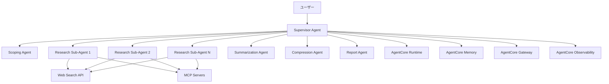

# 設計: Open Deep Research を Strands Agents で再現

## 1. アーキテクチャ概要

### 1.1 システム全体構成



### 1.2 Strands Agents実装パターン

#### マルチエージェントアーキテクチャ
- **Agent-to-Agent (A2A) 通信**: 構造化されたメッセージ交換プロトコル
- **Swarm パターン**: 動的なResearch Sub-Agentsの管理
- **Graph ワークフロー**: 3段階制御ループの実装
- **Session Management**: セッション状態の一貫性保持

#### エージェントの役割分担
1. **Supervisor Agent**: オーケストレーター（単一、永続）
2. **Scoping Agent**: 要求明確化（オンデマンド）
3. **Research Sub-Agents**: 並行研究実行（動的生成）
4. **Summarization Agent**: 情報統合（オンデマンド）
5. **Compression Agent**: データ最適化（オンデマンド）
6. **Report Agent**: 最終出力生成（単一）

## 2. Strands Agentsマルチエージェント設計

### 2.1 エージェント定義と設定

#### Supervisor Agent (Core Orchestrator)
```python
from strands_agents import Agent, Session, A2ACommunication

class SupervisorAgent(Agent):
    def __init__(self):
        super().__init__(
            name="supervisor",
            role="research_orchestrator",
            capabilities=[
                "workflow_control",
                "quality_assessment", 
                "resource_management",
                "gap_analysis"
            ],
            communication_protocol="a2a",
            session_management=True
        )
        self.research_brief = None
        self.active_sub_agents = []
        self.research_state = "inactive"
        
    async def execute_control_loop(self, user_query):
        # 3段階制御ループの実装
        pass
```

#### Research Sub-Agent (Dynamic Workers)
```python
class ResearchSubAgent(Agent):
    def __init__(self, subtopic, agent_id):
        super().__init__(
            name=f"research_sub_{agent_id}",
            role="specialized_researcher",
            capabilities=[
                "web_search",
                "mcp_integration",
                "content_analysis",
                "citation_management"
            ],
            context_isolation=True,
            max_iterations=5
        )
        self.subtopic = subtopic
        self.research_findings = []
        
    async def conduct_research(self, subtopic_brief):
        # 独立した研究タスクの実行
        pass
```

### 2.2 エージェント ライフサイクル管理

#### 動的エージェント生成パターン
```python
class AgentManager:
    def __init__(self, supervisor):
        self.supervisor = supervisor
        self.agent_pool = {}
        self.max_concurrent_agents = 5
        
    async def spawn_research_agent(self, subtopic, priority="normal"):
        """研究サブエージェントの動的生成"""
        agent_id = self.generate_agent_id()
        
        if len(self.agent_pool) >= self.max_concurrent_agents:
            await self.wait_for_completion()
            
        sub_agent = ResearchSubAgent(subtopic, agent_id)
        self.agent_pool[agent_id] = sub_agent
        
        # Strands Agents セッションに登録
        await self.supervisor.session.add_agent(sub_agent)
        return sub_agent
        
    async def terminate_agent(self, agent_id):
        """完了したエージェントの終了とリソース解放"""
        if agent_id in self.agent_pool:
            agent = self.agent_pool.pop(agent_id)
            await agent.cleanup()
            await self.supervisor.session.remove_agent(agent)
```

### 2.3 Swarm 制御実装

#### 並行研究管理
```python
import asyncio
from strands_agents import SwarmController

class ResearchSwarmController(SwarmController):
    def __init__(self, supervisor):
        super().__init__(supervisor)
        self.concurrent_limit = 3
        self.research_queue = asyncio.Queue()
        
    async def coordinate_parallel_research(self, subtopics):
        """複数サブトピックの並行研究調整"""
        tasks = []
        semaphore = asyncio.Semaphore(self.concurrent_limit)
        
        for subtopic in subtopics:
            task = self.execute_subtopic_research(subtopic, semaphore)
            tasks.append(task)
            
        # 並行実行と結果集約
        results = await asyncio.gather(*tasks, return_exceptions=True)
        return self.process_research_results(results)
        
    async def execute_subtopic_research(self, subtopic, semaphore):
        async with semaphore:
            agent = await self.spawn_research_agent(subtopic)
            try:
                result = await agent.conduct_research(subtopic)
                return result
            finally:
                await self.terminate_agent(agent.id)
```

### 2.4 品質制御とギャップ分析

#### Supervisor の評価ロジック
```python
class QualityController:
    def __init__(self, supervisor):
        self.supervisor = supervisor
        self.quality_thresholds = {
            "completeness": 0.8,
            "accuracy": 0.85,
            "depth": 0.75
        }
        
    async def assess_research_quality(self, research_results, research_brief):
        """研究結果の品質評価"""
        assessment = {
            "completeness": await self.evaluate_completeness(research_results, research_brief),
            "accuracy": await self.evaluate_accuracy(research_results),
            "depth": await self.evaluate_depth(research_results),
            "gaps": await self.identify_gaps(research_results, research_brief)
        }
        return assessment
        
    async def identify_research_gaps(self, current_results, target_brief):
        """研究ギャップの特定と追加研究領域の提案"""
        coverage_analysis = await self.analyze_topic_coverage(current_results, target_brief)
        missing_aspects = []
        
        for topic_area in target_brief.required_topics:
            if coverage_analysis.get(topic_area, 0) < self.quality_thresholds["completeness"]:
                missing_aspects.append({
                    "topic": topic_area,
                    "priority": self.calculate_priority(topic_area),
                    "suggested_approach": self.suggest_research_approach(topic_area)
                })
                
        return missing_aspects
```

### 2.5 状態管理とセッション制御

#### 研究セッション管理
```python
from strands_agents import SessionManager, State

class ResearchSession(SessionManager):
    def __init__(self):
        super().__init__()
        self.research_state = {
            "phase": "inactive",  # inactive, scoping, research, reporting
            "research_brief": None,
            "active_agents": {},
            "research_history": [],
            "quality_metrics": {}
        }
        
    async def transition_phase(self, new_phase, context=None):
        """研究フェーズの遷移管理"""
        valid_transitions = {
            "inactive": ["scoping"],
            "scoping": ["research", "inactive"],
            "research": ["reporting", "scoping"],  # 追加スコーピングの可能性
            "reporting": ["inactive"]
        }
        
        if new_phase not in valid_transitions[self.research_state["phase"]]:
            raise ValueError(f"Invalid phase transition: {self.research_state['phase']} -> {new_phase}")
            
        await self.cleanup_current_phase()
        self.research_state["phase"] = new_phase
        await self.initialize_new_phase(new_phase, context)
        
    async def persist_research_state(self):
        """Bedrock AgentCore Memory への状態永続化"""
        pass  # 後のBedrock統合で実装
```

## 3. エージェント間通信プロトコル設計

### 3.1 A2A メッセージング構造

#### 標準メッセージフォーマット
```python
from dataclasses import dataclass
from typing import Dict, Any, Optional
from enum import Enum

class MessageType(Enum):
    TASK_ASSIGNMENT = "task_assignment"
    RESEARCH_RESULT = "research_result"
    QUALITY_FEEDBACK = "quality_feedback"
    STATUS_UPDATE = "status_update"
    TERMINATION_REQUEST = "termination_request"
    
@dataclass
class A2AMessage:
    sender_id: str
    receiver_id: str
    message_type: MessageType
    payload: Dict[str, Any]
    session_id: str
    timestamp: str
    correlation_id: Optional[str] = None
    priority: str = "normal"  # low, normal, high, urgent
```

#### Supervisor → Sub-Agent 通信
```python
# タスク割り当てメッセージ
task_message = A2AMessage(
    sender_id="supervisor",
    receiver_id="research_sub_001",
    message_type=MessageType.TASK_ASSIGNMENT,
    payload={
        "subtopic": "AI governance frameworks 2024",
        "research_brief": research_brief_excerpt,
        "expected_deliverables": [
            "key_findings_summary",
            "source_citations",
            "confidence_assessment"
        ],
        "constraints": {
            "max_iterations": 5,
            "time_limit": "10m",
            "source_types": ["academic", "government", "industry_reports"]
        }
    },
    session_id=current_session.id
)
```

#### Sub-Agent → Supervisor 通信
```python
# 研究結果レポートメッセージ
result_message = A2AMessage(
    sender_id="research_sub_001",
    receiver_id="supervisor",
    message_type=MessageType.RESEARCH_RESULT,
    payload={
        "subtopic": "AI governance frameworks 2024",
        "findings": {
            "summary": "Comprehensive analysis of current AI governance approaches...",
            "key_points": [
                "EU AI Act implementation timeline",
                "US NIST AI Risk Management Framework adoption",
                "Private sector self-regulation initiatives"
            ],
            "sources": [
                {
                    "title": "EU AI Act: Final Text",
                    "url": "https://...",
                    "credibility_score": 0.95,
                    "relevance_score": 0.90
                }
            ]
        },
        "quality_metrics": {
            "confidence_level": 0.88,
            "completeness_estimate": 0.82,
            "potential_gaps": ["Implementation challenges in developing countries"]
        },
        "agent_metadata": {
            "iterations_used": 3,
            "search_queries_executed": 8,
            "processing_time": "7m 32s"
        }
    },
    session_id=current_session.id,
    correlation_id=task_message.correlation_id
)
```

### 3.2 通信ルーティングとロードバランシング

#### メッセージルーター
```python
from strands_agents import MessageRouter, LoadBalancer

class ResearchMessageRouter(MessageRouter):
    def __init__(self):
        super().__init__()
        self.load_balancer = ResearchLoadBalancer()
        self.message_queue = {}
        
    async def route_message(self, message: A2AMessage):
        """メッセージの適切なエージェントへのルーティング"""
        if message.message_type == MessageType.TASK_ASSIGNMENT:
            # 負荷分散を考慮したエージェント選択
            target_agent = await self.load_balancer.select_available_agent(
                capability_required="research",
                priority=message.priority
            )
            message.receiver_id = target_agent.id
            
        await self.deliver_message(message)
        
    async def handle_broadcast(self, message: A2AMessage, agent_filter=None):
        """複数エージェントへの同報配信"""
        target_agents = await self.get_active_agents(agent_filter)
        
        for agent in target_agents:
            broadcast_message = A2AMessage(
                sender_id=message.sender_id,
                receiver_id=agent.id,
                message_type=message.message_type,
                payload=message.payload,
                session_id=message.session_id
            )
            await self.deliver_message(broadcast_message)
```

### 3.3 エラーハンドリングと回復メカニズム

#### 通信エラー処理
```python
class CommunicationErrorHandler:
    def __init__(self, router):
        self.router = router
        self.retry_policies = {
            "network_timeout": {"max_retries": 3, "backoff": "exponential"},
            "agent_unavailable": {"max_retries": 1, "fallback": "reassign"},
            "message_corruption": {"max_retries": 0, "fallback": "regenerate"}
        }
        
    async def handle_communication_failure(self, message, error_type, attempt=1):
        """通信失敗時の回復処理"""
        policy = self.retry_policies.get(error_type, {})
        max_retries = policy.get("max_retries", 0)
        
        if attempt <= max_retries:
            await self.apply_backoff_strategy(policy.get("backoff"), attempt)
            return await self.router.route_message(message)
        else:
            return await self.apply_fallback_strategy(message, policy.get("fallback"))
            
    async def apply_fallback_strategy(self, message, strategy):
        """フォールバック戦略の実行"""
        if strategy == "reassign":
            # 別のエージェントに再割り当て
            return await self.router.reassign_task(message)
        elif strategy == "regenerate":
            # メッセージを再生成
            return await self.regenerate_message(message)
        else:
            # デッドレターキューに送信
            await self.send_to_dead_letter_queue(message)

## 4. 3段階制御ループワークフロー設計

### 4.1 フェーズ1: スコーピング段階の詳細実装

#### ユーザークラリフィケーション プロセス
```python
class ScopingAgent(Agent):
    def __init__(self):
        super().__init__(
            name="scoping_agent",
            role="requirement_clarifier",
            capabilities=["dialogue_management", "context_extraction", "brief_generation"]
        )
        
    async def conduct_clarification_dialogue(self, initial_query):
        """対話的な要求明確化プロセス"""
        dialogue_context = {
            "initial_query": initial_query,
            "clarifications": [],
            "user_responses": [],
            "current_understanding": {}
        }
        
        # 段階的質問生成と実行
        clarification_questions = await self.generate_clarification_questions(initial_query)
        
        for question in clarification_questions:
            user_response = await self.ask_user(question)
            dialogue_context["clarifications"].append(question)
            dialogue_context["user_responses"].append(user_response)
            
            # 理解度の更新
            dialogue_context["current_understanding"] = await self.update_understanding(
                dialogue_context["current_understanding"], 
                question, 
                user_response
            )
            
            # 十分な明確化が得られたか判定
            if await self.is_clarification_sufficient(dialogue_context):
                break
                
        return dialogue_context
```

#### 研究ブリーフ生成システム
```python
class ResearchBriefGenerator:
    def __init__(self):
        self.brief_template = {
            "research_objective": "",
            "scope_boundaries": {},
            "required_topics": [],
            "depth_requirements": {},
            "constraints": {},
            "success_criteria": {},
            "estimated_complexity": ""
        }
        
    async def generate_comprehensive_brief(self, dialogue_context):
        """対話結果から包括的な研究ブリーフを生成"""
        brief = self.brief_template.copy()
        
        # 研究目的の明確化
        brief["research_objective"] = await self.extract_primary_objective(
            dialogue_context["initial_query"],
            dialogue_context["user_responses"]
        )
        
        # スコープ境界の設定
        brief["scope_boundaries"] = await self.define_scope_boundaries(dialogue_context)
        
        # 必要トピックの分解
        brief["required_topics"] = await self.decompose_into_subtopics(
            brief["research_objective"],
            brief["scope_boundaries"]
        )
        
        # 深度要件の評価
        brief["depth_requirements"] = await self.assess_depth_requirements(dialogue_context)
        
        return brief
        
    async def decompose_into_subtopics(self, objective, scope):
        """研究目的を並行処理可能なサブトピックに分解"""
        decomposition_strategy = await self.select_decomposition_strategy(objective)
        
        if decomposition_strategy == "domain_based":
            return await self.domain_based_decomposition(objective, scope)
        elif decomposition_strategy == "temporal_based":
            return await self.temporal_based_decomposition(objective, scope)
        elif decomposition_strategy == "aspect_based":
            return await self.aspect_based_decomposition(objective, scope)
        else:
            return await self.hybrid_decomposition(objective, scope)
```

### 4.2 フェーズ2: 研究段階の並行処理実装

#### 動的サブトピック研究システム
```python
class ParallelResearchController:
    def __init__(self, supervisor):
        self.supervisor = supervisor
        self.active_research_tasks = {}
        self.completed_research = {}
        self.quality_monitor = QualityMonitor()
        
    async def execute_parallel_research(self, research_brief):
        """並行研究の実行とモニタリング"""
        subtopics = research_brief["required_topics"]
        
        # 初期バッチの研究タスク開始
        initial_batch = await self.select_initial_batch(subtopics)
        research_tasks = []
        
        for subtopic in initial_batch:
            task = await self.spawn_research_task(subtopic, research_brief)
            research_tasks.append(task)
            
        # 並行実行とモニタリング
        while research_tasks or self.active_research_tasks:
            # 完了したタスクの処理
            completed_tasks = await self.collect_completed_tasks()
            
            for task_id, result in completed_tasks.items():
                await self.process_research_result(task_id, result)
                
            # 品質評価と追加研究の判定
            quality_assessment = await self.assess_current_progress(research_brief)
            
            if quality_assessment["needs_additional_research"]:
                additional_topics = quality_assessment["additional_topics"]
                for topic in additional_topics:
                    new_task = await self.spawn_research_task(topic, research_brief)
                    research_tasks.append(new_task)
                    
            # 研究完了条件のチェック
            if await self.is_research_complete(research_brief, quality_assessment):
                break
                
        return self.compiled_research_results()
```

#### Supervisor反省ループの実装
```python
class SupervisorReflectionLoop:
    def __init__(self):
        self.max_reflection_iterations = 3
        self.quality_thresholds = {
            "completeness": 0.8,
            "depth": 0.75,
            "coherence": 0.85
        }
        
    async def conduct_reflection_cycle(self, research_results, research_brief):
        """Supervisorによる反省と追加研究の判定"""
        iteration = 0
        
        while iteration < self.max_reflection_iterations:
            # 現在の研究結果の評価
            evaluation = await self.evaluate_research_quality(research_results, research_brief)
            
            # 品質基準の確認
            if self.meets_quality_standards(evaluation):
                return {
                    "status": "complete",
                    "final_results": research_results,
                    "quality_metrics": evaluation
                }
                
            # ギャップ分析と追加研究の計画
            gaps = await self.identify_specific_gaps(evaluation, research_brief)
            
            if not gaps:
                # これ以上の改善が困難な場合
                break
                
            # 追加研究の実行
            additional_research = await self.execute_gap_filling_research(gaps)
            research_results = await self.integrate_additional_research(
                research_results, 
                additional_research
            )
            
            iteration += 1
            
        return {
            "status": "completed_with_limitations",
            "final_results": research_results,
            "quality_metrics": evaluation,
            "unresolved_gaps": gaps
        }
        
    async def identify_specific_gaps(self, evaluation, research_brief):
        """具体的な研究ギャップの特定"""
        gaps = []
        
        # 完全性ギャップ
        if evaluation["completeness"] < self.quality_thresholds["completeness"]:
            missing_topics = await self.find_missing_topics(evaluation, research_brief)
            gaps.extend([{
                "type": "completeness",
                "topic": topic,
                "priority": "high",
                "estimated_effort": self.estimate_research_effort(topic)
            } for topic in missing_topics])
            
        # 深度ギャップ
        if evaluation["depth"] < self.quality_thresholds["depth"]:
            shallow_areas = await self.find_shallow_areas(evaluation)
            gaps.extend([{
                "type": "depth",
                "area": area,
                "priority": "medium",
                "specific_questions": self.generate_deeper_questions(area)
            } for area in shallow_areas])
            
        return gaps
```

### 4.3 フェーズ3: レポート作成段階の統合実装

#### 研究結果統合システム
```python
class ResearchIntegrator:
    def __init__(self):
        self.integration_strategies = {
            "chronological": self.chronological_integration,
            "thematic": self.thematic_integration,
            "analytical": self.analytical_integration,
            "comparative": self.comparative_integration
        }
        
    async def integrate_research_findings(self, research_results, research_brief):
        """複数の研究結果を統合"""
        # 最適な統合戦略の選択
        integration_strategy = await self.select_integration_strategy(
            research_results, 
            research_brief
        )
        
        # 結果の前処理
        preprocessed_results = await self.preprocess_results(research_results)
        
        # 統合実行
        integrated_content = await integration_strategy(
            preprocessed_results, 
            research_brief
        )
        
        # 一貫性チェック
        consistency_check = await self.verify_consistency(integrated_content)
        
        if not consistency_check["is_consistent"]:
            integrated_content = await self.resolve_inconsistencies(
                integrated_content, 
                consistency_check["issues"]
            )
            
        return integrated_content
        
    async def thematic_integration(self, results, brief):
        """テーマベースの統合"""
        themes = await self.extract_common_themes(results)
        integrated_structure = {}
        
        for theme in themes:
            related_findings = await self.gather_theme_related_findings(results, theme)
            synthesized_content = await self.synthesize_findings(related_findings)
            integrated_structure[theme] = synthesized_content
            
        return integrated_structure
```

#### 最終レポート生成エンジン
```python
class FinalReportGenerator:
    def __init__(self):
        self.report_templates = {
            "academic": "academic_research_template.md",
            "business": "business_analysis_template.md",
            "technical": "technical_report_template.md",
            "executive": "executive_summary_template.md"
        }
        
    async def generate_final_report(self, integrated_content, research_brief):
        """統合された研究内容から最終レポートを生成"""
        # レポート形式の決定
        report_format = await self.determine_report_format(research_brief)
        template = self.report_templates[report_format]
        
        # セクション構造の構築
        report_sections = await self.build_report_structure(
            integrated_content, 
            research_brief,
            template
        )
        
        # 各セクションの詳細生成
        detailed_sections = {}
        for section_name, section_outline in report_sections.items():
            detailed_sections[section_name] = await self.generate_section_content(
                section_outline,
                integrated_content,
                section_name
            )
            
        # 引用と参考文献の整理
        citations = await self.compile_citations(integrated_content)
        bibliography = await self.format_bibliography(citations)
        
        # 最終レポートのアセンブリ
        final_report = await self.assemble_final_report(
            detailed_sections,
            bibliography,
            research_brief,
            template
        )
        
        # 品質保証チェック
        qa_result = await self.quality_assurance_check(final_report)
        
        if qa_result["needs_revision"]:
            final_report = await self.apply_revisions(final_report, qa_result["suggestions"])
            
        return final_report
        
    async def quality_assurance_check(self, report):
        """レポートの品質保証チェック"""
        checks = {
            "factual_accuracy": await self.verify_factual_accuracy(report),
            "citation_completeness": await self.verify_citations(report),
            "logical_flow": await self.assess_logical_flow(report),
            "clarity_and_readability": await self.assess_readability(report),
            "completeness": await self.assess_completeness(report)
        }
        
        issues = []
        for check_type, result in checks.items():
            if not result["passed"]:
                issues.append({
                    "type": check_type,
                    "severity": result["severity"],
                    "details": result["details"],
                    "suggested_fix": result["suggested_fix"]
                })
                
        return {
            "needs_revision": len(issues) > 0,
            "issues": issues,
            "suggestions": [issue["suggested_fix"] for issue in issues]
        }
```

### 4.4 エラー処理と回復メカニズム

#### 研究プロセスの障害対応
```python
class ResearchErrorHandler:
    def __init__(self, supervisor):
        self.supervisor = supervisor
        self.recovery_strategies = {
            "agent_timeout": self.handle_agent_timeout,
            "quality_failure": self.handle_quality_failure,
            "resource_exhaustion": self.handle_resource_exhaustion,
            "external_api_failure": self.handle_api_failure
        }
        
    async def handle_research_failure(self, failure_type, context):
        """研究プロセスの失敗に対する包括的な対応"""
        strategy = self.recovery_strategies.get(failure_type)
        
        if not strategy:
            return await self.generic_error_recovery(failure_type, context)
            
        try:
            recovery_result = await strategy(context)
            await self.log_recovery_action(failure_type, context, recovery_result)
            return recovery_result
        except Exception as e:
            await self.escalate_to_manual_intervention(failure_type, context, e)
            raise
            
    async def handle_agent_timeout(self, context):
        """エージェントタイムアウトの処理"""
        failed_agent_id = context["agent_id"]
        incomplete_task = context["task"]
        
        # 失敗したエージェントの終了
        await self.supervisor.terminate_agent(failed_agent_id)
        
        # タスクの再割り当て
        new_agent = await self.supervisor.spawn_research_agent(
            incomplete_task["subtopic"],
            priority="high"
        )
        
        # 部分的な進捗の引き継ぎ
        if context.get("partial_results"):
            await new_agent.initialize_with_partial_results(context["partial_results"])
            
        return {
            "recovery_action": "agent_replacement",
            "new_agent_id": new_agent.id,
            "estimated_delay": "5-10 minutes"
        }

## 5. Bedrock AgentCore統合アーキテクチャ設計

### 5.1 AgentCore サービス統合パターン

#### AgentCore Runtime 統合
```python
from bedrock_agentcore import Runtime, RuntimeConfig
from strands_agents import Agent

class AgentCoreRuntimeAdapter:
    def __init__(self):
        self.runtime_config = RuntimeConfig(
            session_isolation=True,
            max_session_duration="8h",
            memory_limit="4GB",
            cpu_allocation="2vCPU"
        )
        self.runtime = Runtime(self.runtime_config)
        
    async def deploy_strands_agent(self, agent: Agent):
        """Strands AgentをAgentCore Runtimeにデプロイ"""
        # セッション分離された実行環境の作成
        session = await self.runtime.create_isolated_session(
            agent_id=agent.id,
            capabilities=agent.capabilities,
            resource_limits=self.get_resource_limits(agent.role)
        )
        
        # エージェントの実行コンテキスト設定
        execution_context = await session.setup_execution_context(
            environment_variables=agent.get_env_vars(),
            security_policies=self.get_security_policies(agent.role),
            networking_rules=self.get_networking_rules(agent.capabilities)
        )
        
        # マルチモーダル対応の設定
        if agent.requires_multimodal():
            await session.enable_multimodal_support(
                supported_formats=["text", "json", "markdown", "images"],
                processing_limits=self.get_multimodal_limits()
            )
            
        return session
        
    def get_resource_limits(self, agent_role):
        """エージェントロール別リソース制限"""
        resource_profiles = {
            "supervisor": {"cpu": "1vCPU", "memory": "2GB", "storage": "10GB"},
            "research": {"cpu": "0.5vCPU", "memory": "1GB", "storage": "5GB"},
            "report": {"cpu": "1vCPU", "memory": "3GB", "storage": "15GB"}
        }
        return resource_profiles.get(agent_role, resource_profiles["research"])
```

#### AgentCore Memory 統合
```python
from bedrock_agentcore import Memory, MemoryType

class AgentCoreMemoryManager:
    def __init__(self):
        self.short_term_memory = Memory(MemoryType.SHORT_TERM)
        self.long_term_memory = Memory(MemoryType.LONG_TERM)
        self.shared_memory = Memory(MemoryType.SHARED)
        
    async def manage_research_session_memory(self, session_id):
        """研究セッションのメモリ管理"""
        # 短期メモリ: 現在の会話・研究コンテキスト
        session_context = await self.short_term_memory.create_namespace(
            f"research_session_{session_id}",
            retention_policy="session_end",
            max_size="500MB"
        )
        
        # 長期メモリ: 研究履歴・学習データ
        research_history = await self.long_term_memory.create_namespace(
            f"research_history_{session_id}",
            retention_policy="30_days",
            indexing_strategy="semantic_search"
        )
        
        # 共有メモリ: エージェント間での情報共有
        agent_shared_context = await self.shared_memory.create_namespace(
            f"agents_shared_{session_id}",
            retention_policy="session_end",
            access_control="session_scoped"
        )
        
        return {
            "session_context": session_context,
            "research_history": research_history,
            "shared_context": agent_shared_context
        }
        
    async def implement_semantic_retrieval(self, query, memory_namespace):
        """セマンティック検索による関連情報取得"""
        # ベクトル埋め込みによる類似度検索
        search_results = await memory_namespace.semantic_search(
            query=query,
            top_k=10,
            similarity_threshold=0.7
        )
        
        # 結果のランキングと関連度スコアリング
        ranked_results = await self.rank_search_results(search_results, query)
        
        return ranked_results
```

#### AgentCore Gateway 統合
```python
from bedrock_agentcore import Gateway, MCPConnector

class AgentCoreGatewayIntegration:
    def __init__(self):
        self.gateway = Gateway()
        self.mcp_connector = MCPConnector()
        self.registered_tools = {}
        
    async def register_research_tools(self):
        """研究用ツールのMCP統合とGateway登録"""
        
        # Web検索ツールのMCP変換
        web_search_mcp = await self.mcp_connector.convert_to_mcp(
            tool_name="web_search",
            original_interface=WebSearchTool(),
            mcp_schema={
                "name": "web_search",
                "description": "Search the web for research information",
                "parameters": {
                    "type": "object",
                    "properties": {
                        "query": {"type": "string", "description": "Search query"},
                        "max_results": {"type": "integer", "default": 10},
                        "source_filters": {"type": "array", "items": {"type": "string"}}
                    },
                    "required": ["query"]
                }
            }
        )
        
        # Gatewayへの登録
        await self.gateway.register_tool(
            tool=web_search_mcp,
            access_policy="research_agents_only",
            rate_limits={"requests_per_minute": 100, "max_concurrent": 5},
            monitoring_level="detailed"
        )
        
        # MCPサーバー統合
        knowledge_base_mcp = await self.mcp_connector.connect_to_server(
            server_url="knowledge_base_mcp_server",
            authentication=self.get_mcp_auth_config(),
            capabilities=["knowledge_retrieval", "fact_checking"]
        )
        
        await self.gateway.register_tool(
            tool=knowledge_base_mcp,
            access_policy="all_agents",
            rate_limits={"requests_per_minute": 200},
            monitoring_level="standard"
        )
        
        self.registered_tools.update({
            "web_search": web_search_mcp,
            "knowledge_base": knowledge_base_mcp
        })
        
        return self.registered_tools
        
    async def implement_tool_usage_monitoring(self, session_id):
        """ツール使用の監視とガバナンス"""
        monitoring_config = {
            "session_id": session_id,
            "monitoring_level": "comprehensive",
            "alerts": {
                "excessive_usage": {"threshold": 1000, "action": "throttle"},
                "suspicious_patterns": {"threshold": 0.8, "action": "review"},
                "cost_limits": {"threshold": 50.0, "action": "notify"}
            },
            "logging": {
                "log_requests": True,
                "log_responses": True,
                "log_errors": True,
                "retention_period": "30_days"
            }
        }
        
        return await self.gateway.setup_session_monitoring(monitoring_config)
```

#### AgentCore Observability 統合
```python
from bedrock_agentcore import Observability, MetricsCollector, AlertManager

class AgentCoreObservabilityIntegration:
    def __init__(self):
        self.observability = Observability()
        self.metrics_collector = MetricsCollector()
        self.alert_manager = AlertManager()
        
    async def setup_comprehensive_monitoring(self, session_id):
        """包括的な監視システムの設定"""
        
        # エージェント レベル メトリクス
        agent_metrics = await self.metrics_collector.define_custom_metrics([
            {
                "name": "research_quality_score",
                "type": "gauge",
                "description": "Real-time research quality assessment",
                "labels": ["agent_id", "subtopic", "iteration"]
            },
            {
                "name": "agent_processing_time",
                "type": "histogram",
                "description": "Time taken for agent task completion",
                "labels": ["agent_type", "task_complexity"]
            },
            {
                "name": "a2a_communication_latency",
                "type": "histogram", 
                "description": "Agent-to-agent message delivery time",
                "labels": ["sender_type", "receiver_type", "message_type"]
            }
        ])
        
        # システム レベル メトリクス
        system_metrics = await self.metrics_collector.define_system_metrics([
            "concurrent_agents_count",
            "memory_utilization_percentage", 
            "api_call_rate",
            "error_rate_percentage"
        ])
        
        # リアルタイム ダッシュボード設定
        dashboard_config = {
            "session_id": session_id,
            "refresh_interval": "5s",
            "widgets": [
                {
                    "type": "research_progress_timeline",
                    "data_source": "agent_metrics",
                    "filters": {"session_id": session_id}
                },
                {
                    "type": "quality_trends_chart",
                    "data_source": "research_quality_score",
                    "time_range": "last_1h"
                },
                {
                    "type": "agent_network_graph",
                    "data_source": "a2a_communication_latency",
                    "layout": "force_directed"
                }
            ]
        }
        
        dashboard = await self.observability.create_dashboard(dashboard_config)
        
        # インテリジェント アラート設定
        alert_rules = [
            {
                "name": "research_quality_degradation",
                "condition": "research_quality_score < 0.7 for 5m",
                "severity": "warning",
                "action": "trigger_quality_review"
            },
            {
                "name": "agent_unresponsive",
                "condition": "agent_processing_time > 600s",
                "severity": "critical", 
                "action": "initiate_agent_recovery"
            },
            {
                "name": "system_resource_exhaustion",
                "condition": "memory_utilization_percentage > 90% for 2m",
                "severity": "critical",
                "action": "trigger_resource_scaling"
            }
        ]
        
        await self.alert_manager.configure_alerts(alert_rules)
        
        return {
            "dashboard": dashboard,
            "metrics": {**agent_metrics, **system_metrics},
            "alerts": alert_rules
        }
        
    async def implement_distributed_tracing(self, session_id):
        """分散トレーシングによる詳細な実行追跡"""
        trace_config = {
            "session_id": session_id,
            "sampling_rate": 1.0,  # 100% sampling for research sessions
            "trace_components": [
                "supervisor_control_loop",
                "agent_spawning_lifecycle", 
                "a2a_message_routing",
                "tool_invocation_chain",
                "quality_assessment_pipeline"
            ],
            "custom_attributes": {
                "research_domain": "dynamic",
                "user_profile": "dynamic", 
                "complexity_level": "dynamic"
            }
        }
        
        return await self.observability.enable_distributed_tracing(trace_config)
```

#### AgentCore Identity 統合
```python
from bedrock_agentcore import Identity, PermissionManager, AuditLogger

class AgentCoreIdentityManager:
    def __init__(self):
        self.identity = Identity()
        self.permission_manager = PermissionManager()
        self.audit_logger = AuditLogger()
        
    async def setup_agent_identity(self, agent, session_id):
        """エージェント固有のアイデンティティとアクセス制御設定"""
        
        # エージェント アイデンティティ作成
        agent_identity = await self.identity.create_agent_identity(
            agent_id=agent.id,
            agent_type=agent.role,
            session_id=session_id,
            capabilities=agent.capabilities
        )
        
        # ロールベース権限設定
        role_permissions = await self.define_role_permissions(agent.role)
        await self.permission_manager.assign_permissions(
            identity=agent_identity,
            permissions=role_permissions
        )
        
        # セッション固有権限設定
        session_permissions = await self.define_session_permissions(session_id, agent.role)
        await self.permission_manager.assign_session_permissions(
            identity=agent_identity,
            session_id=session_id,
            permissions=session_permissions
        )
        
        # 監査ログ設定
        audit_config = {
            "agent_id": agent.id,
            "session_id": session_id,
            "log_level": "detailed",
            "events_to_log": [
                "tool_access_attempts",
                "permission_checks",
                "resource_access",
                "inter_agent_communications"
            ]
        }
        
        await self.audit_logger.configure_agent_auditing(audit_config)
        
        return agent_identity
        
    async def define_role_permissions(self, agent_role):
        """エージェントロール別の権限定義"""
        permission_templates = {
            "supervisor": {
                "tools": ["all"],
                "memory": ["read", "write", "manage_namespaces"],
                "agents": ["spawn", "terminate", "monitor", "communicate"],
                "resources": ["allocate", "deallocate", "monitor"]
            },
            "research": {
                "tools": ["web_search", "knowledge_base", "citation_manager"],
                "memory": ["read", "write_own_namespace"],
                "agents": ["communicate_with_supervisor"],
                "resources": ["use_allocated"]
            },
            "scoping": {
                "tools": ["user_interface", "brief_generator"],
                "memory": ["read", "write_session_context"],
                "agents": ["communicate_with_supervisor"],
                "resources": ["use_allocated"]
            },
            "report": {
                "tools": ["document_generator", "citation_formatter", "quality_checker"],
                "memory": ["read_all_session", "write_final_output"],
                "agents": ["communicate_with_supervisor"],
                "resources": ["use_allocated", "generate_artifacts"]
            }
        }
        
        return permission_templates.get(agent_role, permission_templates["research"])
        
    async def implement_fine_grained_access_control(self, session_id):
        """細粒度アクセス制御の実装"""
        access_policies = [
            {
                "policy_name": "research_data_isolation",
                "scope": "session",
                "rules": [
                    "agents can only access their assigned research topics",
                    "supervisor can access all research data within session",
                    "cross-session data access is prohibited"
                ]
            },
            {
                "policy_name": "tool_usage_governance", 
                "scope": "global",
                "rules": [
                    "web_search limited to 100 requests/hour per agent",
                    "expensive_tools require supervisor approval",
                    "tool usage must be logged for audit"
                ]
            },
            {
                "policy_name": "inter_agent_communication",
                "scope": "session",
                "rules": [
                    "research agents can only communicate with supervisor",
                    "supervisor can communicate with all agents",
                    "all messages must include session_id and correlation_id"
                ]
            }
        ]
        
        for policy in access_policies:
            await self.permission_manager.implement_access_policy(
                session_id=session_id,
                policy=policy
            )
```

### 5.2 統合アーキテクチャ実装

#### 完全統合 Supervisor Agent
```python
from strands_agents import Agent
from .bedrock_integration import *

class BedrockIntegratedSupervisor(SupervisorAgent):
    def __init__(self):
        super().__init__()
        
        # Bedrock AgentCore サービス統合
        self.runtime_adapter = AgentCoreRuntimeAdapter()
        self.memory_manager = AgentCoreMemoryManager() 
        self.gateway_integration = AgentCoreGatewayIntegration()
        self.observability = AgentCoreObservabilityIntegration()
        self.identity_manager = AgentCoreIdentityManager()
        
        # 統合状態管理
        self.bedrock_session_state = {}
        
    async def initialize_bedrock_integrated_session(self, user_query):
        """Bedrock AgentCore統合セッションの初期化"""
        session_id = self.generate_session_id()
        
        # 1. Runtime環境の設定
        supervisor_session = await self.runtime_adapter.deploy_strands_agent(self)
        
        # 2. Identity & Access管理
        supervisor_identity = await self.identity_manager.setup_agent_identity(self, session_id)
        await self.identity_manager.implement_fine_grained_access_control(session_id)
        
        # 3. Memory名前空間の作成
        memory_namespaces = await self.memory_manager.manage_research_session_memory(session_id)
        
        # 4. Tools & Gateway設定
        research_tools = await self.gateway_integration.register_research_tools()
        tool_monitoring = await self.gateway_integration.implement_tool_usage_monitoring(session_id)
        
        # 5. Observability & Monitoring
        monitoring_setup = await self.observability.setup_comprehensive_monitoring(session_id)
        distributed_tracing = await self.observability.implement_distributed_tracing(session_id)
        
        # セッション状態の記録
        self.bedrock_session_state[session_id] = {
            "runtime_session": supervisor_session,
            "identity": supervisor_identity,
            "memory_namespaces": memory_namespaces,
            "tools": research_tools,
            "monitoring": monitoring_setup,
            "tracing": distributed_tracing,
            "status": "initialized"
        }
        
        return session_id
        
    async def execute_bedrock_integrated_control_loop(self, user_query):
        """Bedrock AgentCore統合環境での制御ループ実行"""
        session_id = await self.initialize_bedrock_integrated_session(user_query)
        
        try:
            # Phase 1: Scoping with Identity & Memory integration
            research_brief = await self.execute_integrated_scoping_phase(
                user_query, 
                session_id
            )
            
            # Phase 2: Research with Runtime & Gateway integration  
            research_results = await self.execute_integrated_research_phase(
                research_brief, 
                session_id
            )
            
            # Phase 3: Report with Observability integration
            final_report = await self.execute_integrated_report_phase(
                research_results, 
                research_brief, 
                session_id
            )
            
            # Session cleanup
            await self.cleanup_bedrock_session(session_id)
            
            return final_report
            
        except Exception as e:
            await self.handle_bedrock_integrated_error(e, session_id)
            raise
            
    async def spawn_bedrock_integrated_research_agent(self, subtopic, session_id):
        """Bedrock統合環境でのResearch Sub-Agent生成"""
        # エージェント作成
        research_agent = ResearchSubAgent(subtopic, self.generate_agent_id())
        
        # Runtime環境へのデプロイ
        agent_session = await self.runtime_adapter.deploy_strands_agent(research_agent)
        
        # Identity設定
        agent_identity = await self.identity_manager.setup_agent_identity(
            research_agent, 
            session_id
        )
        
        # Memory アクセス設定
        memory_access = await self.memory_manager.grant_agent_memory_access(
            research_agent.id,
            session_id,
            ["session_context", "shared_context"]
        )
        
        # Tool アクセス設定
        tool_access = await self.gateway_integration.grant_tool_access(
            research_agent.id,
            ["web_search", "knowledge_base"]
        )
        
        # Monitoring設定
        await self.observability.add_agent_to_monitoring(
            research_agent.id,
            session_id
        )
        
        return research_agent
```

### 5.3 移行戦略実装

#### 段階的移行実行システム
```python
class RuntimeMigrationExecutor:
    def __init__(self, local_config, bedrock_config):
        self.local_config = local_config
        self.bedrock_config = bedrock_config
        self.migration_state = "not_started"
        self.migration_checkpoints = []
        
    async def execute_runtime_migration(self):
        """ローカル→Bedrock AgentCore段階的移行の実行"""
        
        # 移行前検証
        await self.pre_migration_validation()
        
        # Phase 1: Runtime Migration
        runtime_migration = await self.migrate_runtime_environment()
        self.add_checkpoint("runtime_migrated", runtime_migration)
        
        # Phase 2: Memory Migration  
        memory_migration = await self.migrate_memory_systems()
        self.add_checkpoint("memory_migrated", memory_migration)
        
        # Phase 3: Agent Migration
        agent_migration = await self.migrate_agent_systems()
        self.add_checkpoint("agents_migrated", agent_migration)
        
        # Phase 4: Tools & Gateway Migration
        tools_migration = await self.migrate_tools_and_gateway()
        self.add_checkpoint("tools_migrated", tools_migration)
        
        # Phase 5: Observability Migration
        observability_migration = await self.migrate_observability_systems()
        self.add_checkpoint("observability_migrated", observability_migration)
        
        # 移行後検証
        await self.post_migration_validation()
        
        self.migration_state = "completed"
        return self.generate_migration_report()
        
    async def migrate_runtime_environment(self):
        """Runtime環境の移行"""
        runtime_adapter = AgentCoreRuntimeAdapter()
        
        # ローカル環境からの設定取得
        local_agents = await self.get_local_agent_configurations()
        
        migration_results = {}
        
        for agent_config in local_agents:
            # Bedrock Runtimeへのデプロイ
            bedrock_session = await runtime_adapter.deploy_strands_agent(
                agent_config["agent"]
            )
            
            # 設定の移行
            await self.migrate_agent_configuration(
                agent_config,
                bedrock_session
            )
            
            migration_results[agent_config["agent"].id] = {
                "status": "migrated",
                "bedrock_session": bedrock_session.id,
                "resource_allocation": bedrock_session.resource_limits
            }
            
        return migration_results
        
    async def implement_rollback_capability(self):
        """ロールバック機能の実装"""
        rollback_strategy = {
            "backup_local_state": await self.backup_local_system_state(),
            "checkpoint_bedrock_state": self.migration_checkpoints,
            "rollback_procedures": {
                "runtime": self.rollback_runtime_migration,
                "memory": self.rollback_memory_migration,
                "agents": self.rollback_agent_migration,
                "tools": self.rollback_tools_migration,
                "observability": self.rollback_observability_migration
            }
        }
        
        return rollback_strategy
        
    async def execute_emergency_rollback(self, rollback_point="last_checkpoint"):
        """緊急時ロールバックの実行"""
        if rollback_point == "complete":
            # 完全ロールバック: ローカル環境への復帰
            await self.restore_local_system_state()
            await self.cleanup_bedrock_resources()
        else:
            # 部分ロールバック: 指定チェックポイントまで
            checkpoint = self.find_checkpoint(rollback_point)
            await self.rollback_to_checkpoint(checkpoint)
            
        self.migration_state = f"rolled_back_to_{rollback_point}"
```

## 6. ローカル→クラウド移行手順

### 6.1 移行準備フェーズ

#### 移行計画策定
```python
class MigrationPlanner:
    def __init__(self):
        self.migration_phases = [
            "preparation", 
            "infrastructure_setup",
            "service_migration", 
            "validation",
            "cutover"
        ]
        
    async def create_migration_plan(self, current_system):
        """移行計画の策定"""
        plan = {
            "assessment": await self.assess_current_system(current_system),
            "requirements": await self.define_cloud_requirements(),
            "timeline": await self.estimate_migration_timeline(),
            "risks": await self.identify_migration_risks(),
            "rollback_strategy": await self.plan_rollback_strategy()
        }
        
        return plan
        
    async def assess_current_system(self, system):
        """現行システムの評価"""
        assessment = {
            "agents": {
                "count": len(system.agents),
                "types": [agent.role for agent in system.agents],
                "resource_usage": await self.measure_resource_usage(system.agents)
            },
            "data": {
                "volume": await self.measure_data_volume(system),
                "structure": await self.analyze_data_structure(system),
                "dependencies": await self.map_data_dependencies(system)
            },
            "integrations": {
                "external_apis": await self.catalog_external_apis(system),
                "tools": await self.catalog_tools(system),
                "workflows": await self.analyze_workflows(system)
            }
        }
        
        return assessment
```

### 6.2 段階的移行実装

#### インフラストラクチャ準備
```python
class CloudInfrastructureSetup:
    def __init__(self, bedrock_config):
        self.bedrock_config = bedrock_config
        
    async def provision_agentcore_infrastructure(self):
        """AgentCore インフラストラクチャのプロビジョニング"""
        
        # 1. Runtime環境の設定
        runtime_setup = await self.setup_agentcore_runtime()
        
        # 2. Memory サービスの設定  
        memory_setup = await self.setup_agentcore_memory()
        
        # 3. Gateway サービスの設定
        gateway_setup = await self.setup_agentcore_gateway()
        
        # 4. Identity サービスの設定
        identity_setup = await self.setup_agentcore_identity()
        
        # 5. Observability サービスの設定
        observability_setup = await self.setup_agentcore_observability()
        
        # 6. ネットワーク & セキュリティ設定
        network_setup = await self.setup_network_security()
        
        return {
            "runtime": runtime_setup,
            "memory": memory_setup, 
            "gateway": gateway_setup,
            "identity": identity_setup,
            "observability": observability_setup,
            "network": network_setup
        }
        
    async def setup_agentcore_runtime(self):
        """AgentCore Runtime環境の詳細設定"""
        runtime_config = {
            "compute_resources": {
                "supervisor_agents": {
                    "cpu": "2vCPU",
                    "memory": "4GB", 
                    "storage": "20GB"
                },
                "research_agents": {
                    "cpu": "1vCPU",
                    "memory": "2GB",
                    "storage": "10GB"
                }
            },
            "session_management": {
                "max_concurrent_sessions": 10,
                "session_timeout": "8h",
                "session_isolation": "strict"
            },
            "auto_scaling": {
                "enabled": True,
                "min_instances": 2,
                "max_instances": 20,
                "scaling_triggers": {
                    "cpu_utilization": 70,
                    "memory_utilization": 80,
                    "queue_depth": 50
                }
            }
        }
        
        return await self.apply_runtime_configuration(runtime_config)
```

### 6.3 切り替え戦略

#### Blue-Green デプロイメント
```python
class BlueGreenMigrationStrategy:
    def __init__(self):
        self.blue_environment = "local"  # 現行環境
        self.green_environment = "bedrock"  # 新環境
        self.traffic_split = {"blue": 100, "green": 0}
        
    async def execute_gradual_cutover(self):
        """段階的な環境切り替えの実行"""
        
        # Phase 1: Green環境での検証 (0% traffic)
        await self.validate_green_environment()
        
        # Phase 2: Canary 展開 (5% traffic to Green)
        await self.shift_traffic({"blue": 95, "green": 5})
        await self.monitor_canary_metrics(duration="1h")
        
        # Phase 3: 段階的展開 (50% traffic to Green)
        await self.shift_traffic({"blue": 50, "green": 50})
        await self.monitor_performance_metrics(duration="2h")
        
        # Phase 4: フル移行 (100% traffic to Green)
        await self.shift_traffic({"blue": 0, "green": 100})
        await self.monitor_full_migration(duration="24h")
        
        # Phase 5: Blue環境のクリーンアップ
        await self.cleanup_blue_environment()
        
    async def monitor_migration_health(self):
        """移行過程の健全性監視"""
        health_metrics = {
            "response_time": await self.measure_response_times(),
            "error_rate": await self.measure_error_rates(),
            "throughput": await self.measure_throughput(),
            "resource_utilization": await self.measure_resource_usage(),
            "user_experience": await self.measure_user_satisfaction()
        }
        
        # 閾値チェック
        if not self.meets_health_thresholds(health_metrics):
            await self.trigger_emergency_rollback()
            
        return health_metrics
```

## 7. 実装優先順位と次のステップ

### 7.1 重要度に基づく実装順序

#### フェーズ1: 基盤実装 (最優先)
1. **BaseAgent & SupervisorAgent**: コアエージェント実装
2. **A2A通信システム**: エージェント間通信基盤
3. **基本的なSwarm制御**: 並行エージェント管理
4. **Mock Tools**: 開発・テスト用モック実装

#### フェーズ2: 機能実装 (高優先)
1. **3段階制御ループ**: スコーピング→研究→レポート
2. **Research Sub-Agents**: 並行研究エージェント
3. **品質制御システム**: ギャップ分析・品質評価
4. **エラー処理・回復**: 堅牢性確保

#### フェーズ3: 統合実装 (中優先)  
1. **Bedrock AgentCore Runtime**: クラウド実行環境
2. **AgentCore Memory**: クラウドメモリ管理
3. **AgentCore Gateway**: ツール統合基盤
4. **移行システム**: ローカル→クラウド移行

#### フェーズ4: 最適化実装 (低優先)
1. **AgentCore Observability**: 高度な監視
2. **AgentCore Identity**: 詳細アクセス制御  
3. **評価システム**: 定量的品質評価
4. **自動最適化**: パフォーマンス調整

### 7.2 次のステップ

#### 直近の実装タスク
1. **要件定義の承認確認**: ステークホルダーとの要件すり合わせ
2. **技術スタックの確定**: Strands Agents SDKの詳細調査
3. **プロトタイプ実装**: 最小機能でのPOC作成
4. **開発環境構築**: CI/CD、テスト環境の整備

#### 設計詳細化が必要な領域
1. **Strands Agents実装詳細**: SDK固有の実装パターン
2. **パフォーマンス要件**: 具体的な性能目標設定
3. **セキュリティ仕様**: 詳細なセキュリティポリシー
4. **運用手順**: デプロイ、監視、保守の手順策定