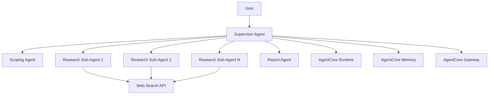

# Open Deep Research Strands

[](https://opensource.org/licenses/MIT)
[](https://www.python.org/downloads/)
[](https://github.com/yourusername/open-deep-research-strands)

A next-generation multi-agent research system that reimplements Open Deep Research using the Strands Agents framework. This project aims to create a production-ready, scalable research platform with advanced agent-to-agent communication, cloud integration, and comprehensive quality control.

## 🎯 Project Overview

Open Deep Research Strands transforms the original LangGraph-based Open Deep Research system into a robust, enterprise-grade solution using Strands Agents. The system features:

- **Multi-Agent Architecture**: Supervisor-controlled research agents with dynamic spawning and lifecycle management
- **3-Phase Research Process**: Scoping → Research → Report with iterative quality improvement
- **Agent-to-Agent (A2A) Communication**: Structured message exchange protocols for efficient coordination
- **Cloud Integration**: Seamless migration path to AWS Bedrock AgentCore for production deployment
- **Quality Assurance**: Multi-dimensional evaluation system with gap analysis and automatic research refinement

## 🏗️ Architecture



### Core Components

- **Supervisor Agent**: Orchestrates the entire research workflow with 3-phase control loops
- **Scoping Agent**: Conducts interactive clarification dialogues with users
- **Research Sub-Agents**: Execute parallel research on specific subtopics with context isolation
- **Report Agent**: Integrates findings and generates structured, high-quality reports
- **Quality Controller**: Provides multi-dimensional assessment and gap analysis

## 🚀 Quick Start

### Prerequisites

- Python 3.8 or higher
- Virtual environment (recommended)
- API keys for LLM providers (OpenAI, Anthropic, etc.)

### Installation

1. **Clone the repository**
   ```bash
   git clone https://github.com/yourusername/open-deep-research-strands.git
   cd open-deep-research-strands
   ```

2. **Create and activate virtual environment**
   ```bash
   python -m venv venv
   source venv/bin/activate  # On Windows: venv\Scripts\activate
   ```

3. **Install dependencies**
   ```bash
   pip install -r requirements.txt
   ```

4. **Set up configuration**
   ```bash
   cp open_deep_research_strands/configs/local_config.py.example open_deep_research_strands/configs/local_config.py
   # Edit the configuration file with your API keys and preferences
   ```

5. **Run initial setup validation**
   ```bash
   python open_deep_research_strands/scripts/validate_setup.py
   ```

### Basic Usage

```python
from open_deep_research_strands.src.agents.supervisor_agent import SupervisorAgent
import asyncio

async def main():
    # Initialize the supervisor agent
    supervisor = SupervisorAgent()
    
    # Execute research
    query = "What are the latest developments in AI governance frameworks in 2024?"
    result = await supervisor.execute_control_loop(query)
    
    print("Research completed!")
    print(f"Report: {result}")

if __name__ == "__main__":
    asyncio.run(main())
```

## 📁 Project Structure

```
open-deep-research-strands/
├── README.md                          # This file
├── LICENSE                            # MIT License
├── requirements.txt                   # Python dependencies
├── .gitignore                        # Git ignore rules
├── open_deep_research_strands/       # Main project directory
│   ├── src/                          # Source code
│   │   ├── agents/                   # Agent implementations
│   │   │   ├── supervisor_agent.py   # Main orchestrator
│   │   │   ├── scoping_agent.py      # User interaction
│   │   │   ├── research_sub_agent.py # Research workers
│   │   │   └── report_agent.py       # Report generation
│   │   ├── communication/            # A2A messaging
│   │   ├── workflows/                # Research workflows
│   │   ├── tools/                    # Research tools
│   │   └── config/                   # Configuration
│   ├── tests/                        # Test suites
│   ├── scripts/                      # Setup and validation
│   └── configs/                      # Configuration files
└── docs/                             # Documentation
```

## 🔧 Development

### Running Tests

```bash
# Run all tests
python -m pytest open_deep_research_strands/tests/

# Run specific test categories
python -m pytest open_deep_research_strands/tests/test_basic_agents.py
python -m pytest open_deep_research_strands/tests/test_integration.py
```

### Development Validation

```bash
# Validate agent functionality
python open_deep_research_strands/scripts/validate_agents.py

# Test A2A communication
python open_deep_research_strands/scripts/validate_a2a_communication.py

# Full integration test
python open_deep_research_strands/scripts/validate_integration.py
```

## 🔮 Roadmap

### Phase 1: Local Development Environment ✅
- [x] Basic agent implementation
- [x] A2A communication system
- [x] Mock tools and services
- [x] Local integration testing

### Phase 2: Core Functionality (In Progress)
- [ ] 3-phase control loop implementation
- [ ] Parallel research coordination
- [ ] Quality control and gap analysis
- [ ] Comprehensive error handling

### Phase 3: Cloud Integration (Planned)
- [ ] AWS Bedrock AgentCore integration
- [ ] Production deployment capabilities
- [ ] Advanced monitoring and observability
- [ ] Enterprise security features

### Phase 4: Optimization (Planned)
- [ ] Performance tuning
- [ ] Advanced evaluation metrics
- [ ] Continuous quality monitoring
- [ ] Baseline comparison with original Open Deep Research

## 🤝 Contributing

We welcome contributions! Please see our [Contributing Guidelines](CONTRIBUTING.md) for details on:

- Development setup
- Code style and standards
- Testing requirements
- Pull request process

### Development Setup

1. Fork the repository
2. Create a feature branch
3. Make your changes
4. Add tests for new functionality
5. Ensure all tests pass
6. Submit a pull request

## 📊 Performance & Quality

The system includes comprehensive evaluation across multiple dimensions:

- **Accuracy**: Factual correctness and source reliability (Target: ≥0.85)
- **Depth**: Analysis comprehensiveness (Target: ≥0.80)
- **Source Quality**: Authority and relevance of citations (Target: ≥0.90)
- **Reasoning Clarity**: Logical consistency and explanation clarity (Target: ≥0.85)
- **Completeness**: Coverage of research objectives (Target: ≥0.80)

## 🔒 Security & Privacy

- API key management with encryption
- Secure agent-to-agent communication
- Data isolation between research sessions
- Comprehensive audit logging
- Configurable access controls

## 📄 License

This project is licensed under the MIT License - see the [LICENSE](LICENSE) file for details.

## 🙏 Acknowledgments

- Original [Open Deep Research](https://github.com/aidev9/open-deep-research) project
- [Strands Agents](https://www.strandsai.com/) framework
- AWS Bedrock AgentCore platform

## 📞 Support

- **Issues**: [GitHub Issues](https://github.com/yourusername/open-deep-research-strands/issues)
- **Discussions**: [GitHub Discussions](https://github.com/yourusername/open-deep-research-strands/discussions)
- **Documentation**: [Wiki](https://github.com/yourusername/open-deep-research-strands/wiki)

## 🌟 Star History

[](https://star-history.com/#yourusername/open-deep-research-strands&Date)

---

**Note**: This project is currently in active development. Features and APIs may change. Please refer to the [CHANGELOG](CHANGELOG.md) for updates and breaking changes.